# NepAI — How Everything Works (Interview Guide)

Plain-language walkthrough of the full stack: what each part does, how frontend talks to backend, and answers you can give in a frontend / fullstack interview.

> This document explains the current codebase. It does not replace `README.md`, `frontend/README.md`, or `backend/README.md` for setup steps.

---

## 1. One-sentence pitch

**NepAI** is a web app that shows Nepal Stock Exchange (NEPSE) market data, trains a separate AI model per stock, forecasts prices for the next few days, and lets logged-in users track a personal portfolio.

---

## 2. Big picture architecture

```
┌─────────────┐     HTTP REST (/api/...)      ┌──────────────────┐
│   Browser   │ ─────────────────────────────► │  FastAPI backend │
│  React SPA  │ ◄───────────────────────────── │  (Python)        │
└─────────────┘         JSON responses         └────────┬─────────┘
                                                        │
                    ┌───────────────────────────────────┼──────────────────┐
                    ▼                                   ▼                  ▼
           CSV price files                    Supabase Postgres      Supabase Storage
         (data/companies/)                    (auth, profiles,       (model.pt +
                                               portfolio, models)      scalers)
```


| Layer         | Role                                                                                 |
| ------------- | ------------------------------------------------------------------------------------ |
| **Frontend**  | UI only. Never talks to Supabase or PyTorch directly. All data via backend REST.     |
| **Backend**   | API, auth proxy, portfolio CRUD, ML train/predict, reads CSVs, talks to Supabase.    |
| **CSV files** | Historical OHLC prices (one file per ticker). Updated by a scraper (GitHub Actions). |
| **Supabase**  | Auth users, profile rows, portfolio rows, model metadata, model file storage.        |


### Why this split?

- **Secrets stay on the server** — Supabase service role key never goes in the browser.
- **Heavy ML stays on the server** — PyTorch training/inference is too heavy for the client.
- **UI stays fast** — React only renders JSON it already received.

---

## 2A. Diagrams, schema & how everything connects

Interview-ready visuals. Mermaid renders in GitHub / many Markdown previewers.

### A. System architecture (who talks to whom)

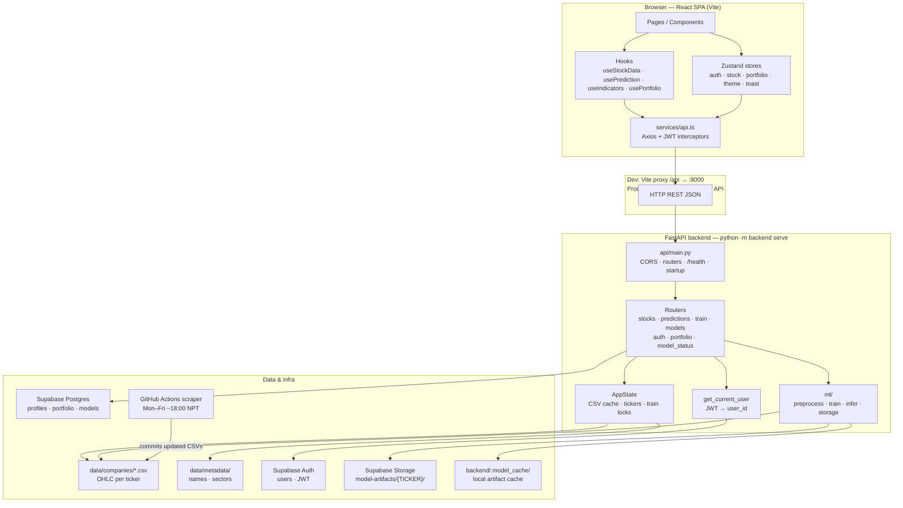

**How to read it:** The browser never opens Supabase or PyTorch. Axios hits FastAPI only. FastAPI reads CSVs for market data, verifies JWTs with Supabase Auth, CRUD-reads Postgres for portfolio/profiles/model metadata, and loads/saves `.pt` + scalers from Storage (with a local cache).

---

### B. Frontend component connection diagram

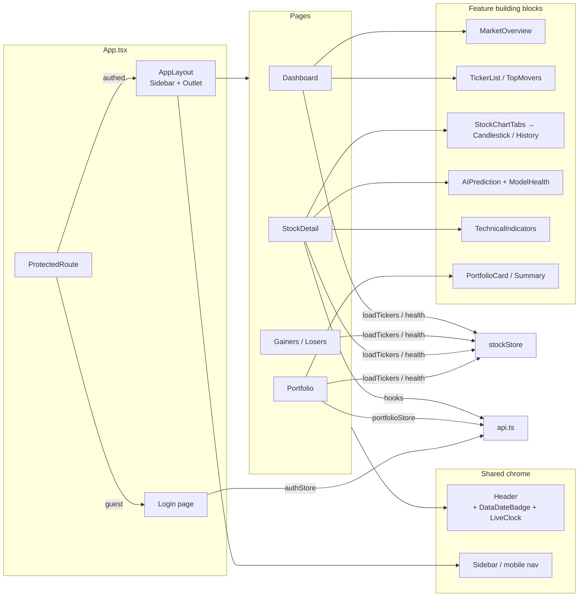

**Connection rules:**

| From | To | Why |
|------|----|-----|
| Page | Header / widgets / cards | Compose UI |
| Widgets | `stockStore` | Shared ticker list + data date |
| Stock page | hooks → `api.ts` | Per-ticker OHLC / predict / indicators |
| Any authed call | Axios interceptor | Attach Bearer; refresh on 401 |
| `authStore` | `configureAuthHandlers` | Wire tokens into Axios |

---

### C. Backend services — how each layer works

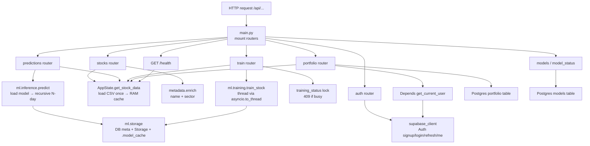

**Service roles in one line:**

| Service / module | Job |
|------------------|-----|
| `AppState` | Ticker registry, CSV DataFrame cache, train-in-progress map, latest data date |
| `metadata` | Attach `stock_name` / `stock_sector` onto JSON responses |
| `get_current_user` | Validate Bearer JWT → `user_id` |
| `ml.preprocessing` | CSV → features + scalers inputs |
| `ml.training` | Fit LSTM, write artifacts |
| `ml.inference` | Forecast 1–14 days + circuit breaker |
| `ml.storage` | Sync `models` row + Storage bucket + local cache |
| `supabase_client` | Single service-role client for Auth + DB + Storage |

---

### D. Data schema (Postgres + files + storage)

```mermaid
erDiagram
  AUTH_USERS ||--|| PROFILES : "trigger on signup"
  AUTH_USERS ||--o{ PORTFOLIO : "owns"
  MODELS ||--|| STORAGE_ARTIFACTS : "ticker key"

  AUTH_USERS {
    uuid id PK
    string email
  }

  PROFILES {
    uuid id PK_FK
    text full_name
    text email
  }

  PORTFOLIO {
    uuid id PK
    uuid user_id FK
    text ticker
    int quantity
    numeric entry_price
    timestamptz added_at
  }

  MODELS {
    text ticker PK
    timestamptz date_created
    numeric mae
    numeric mape
    numeric r2
    numeric rmse
    numeric direction_accuracy
    int n_features
    jsonb feature_cols
    int training_rows
    int seq_len
    jsonb date_range
    numeric training_time_sec
    int epochs_trained
  }

  STORAGE_ARTIFACTS {
    text path "TICKER/model.pt"
    text scaler_feature "TICKER/scaler_feature.pkl"
    text scaler_target "TICKER/scaler_target.pkl"
  }

  CSV_FILES {
    text filename "TICKER.csv"
    date published_date
    float open_high_low_close
    float per_change
    int traded_quantity
  }
```

**Schema notes:**

- `profiles.id` = `auth.users.id` (1:1, created by DB trigger).
- `portfolio` is many rows per user; live P&L uses **CSV latest close**, not a price column in DB.
- `models` is one row per ticker (upsert on retrain).
- Binary weights live in **Storage**, not in Postgres.
- Market history lives in **git-tracked CSVs**, not in Supabase.

---

### E. Auth sequence (login → protected call → refresh)

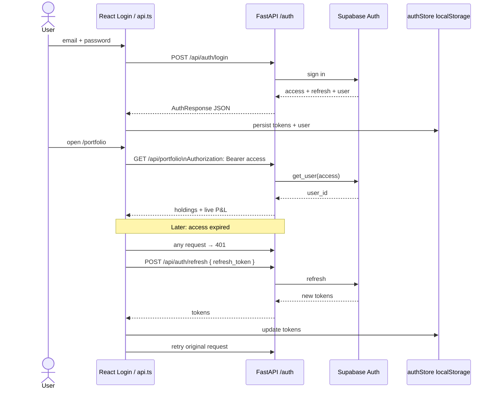

---

### F. Endpoint map — what each route does

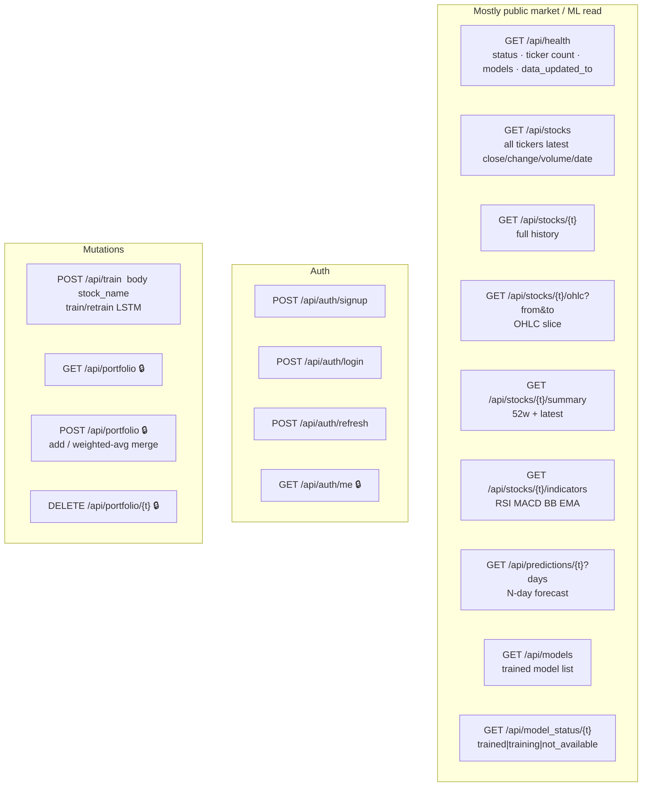

🔒 = Bearer JWT required (`Depends(get_current_user)`).

---

### G. Endpoint flows (request → work → response)

#### G1. `GET /api/stocks` (Dashboard)

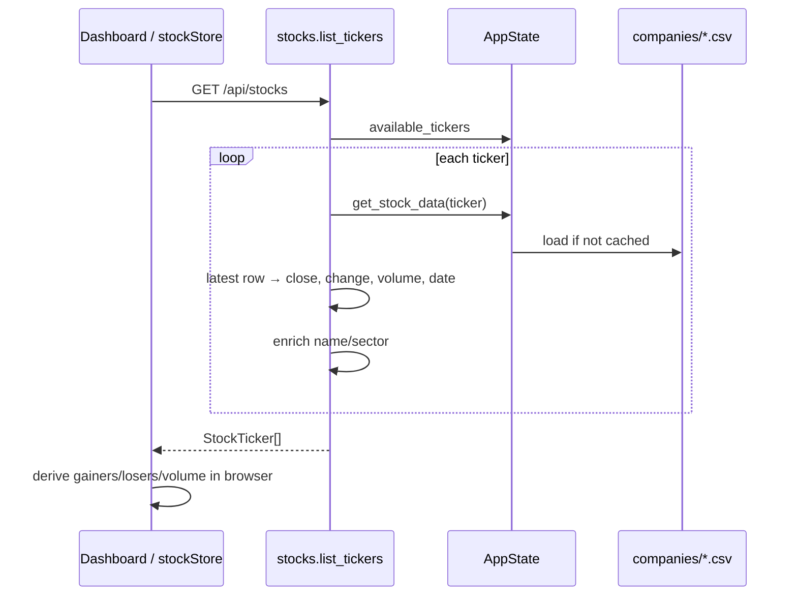

#### G2. `GET /api/predictions/{ticker}` (AI card)

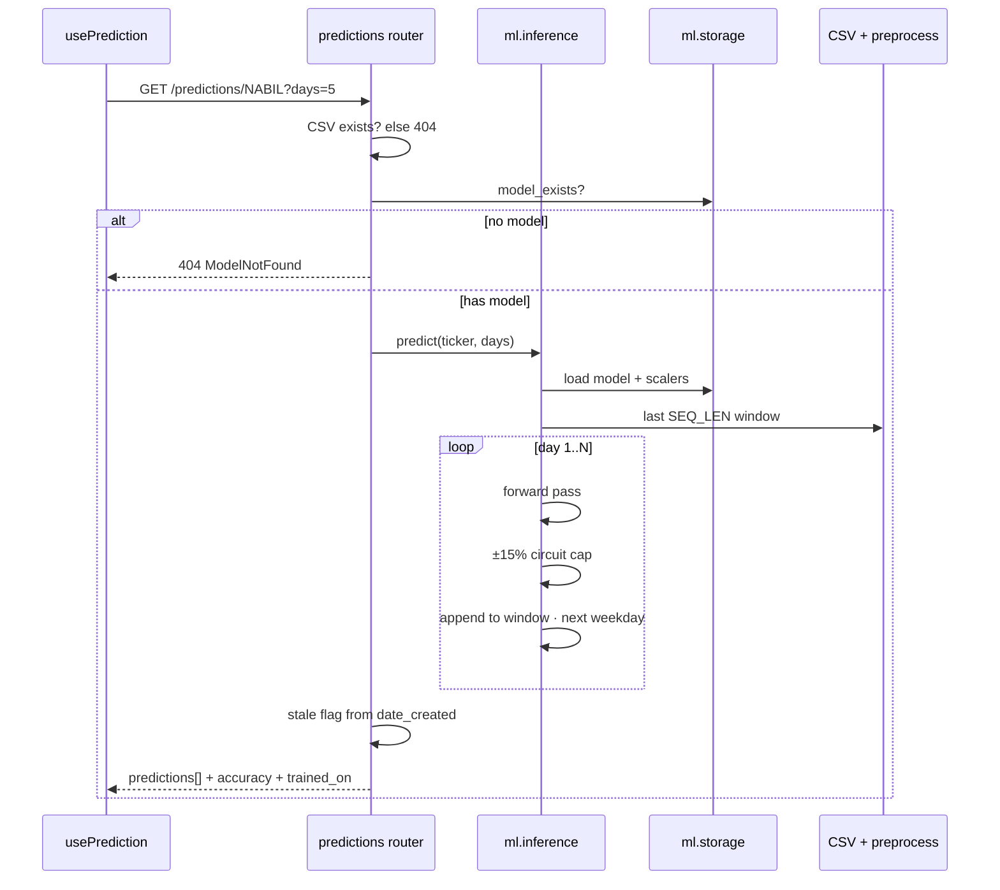

#### G3. `POST /api/train` (Train / Retrain)

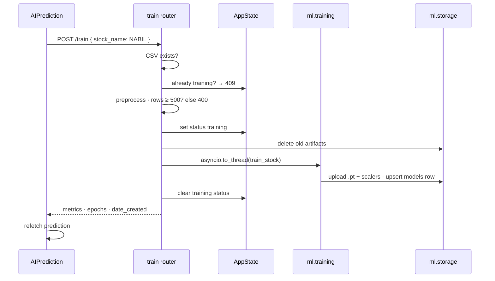

#### G4. Portfolio `GET` / `POST` / `DELETE`

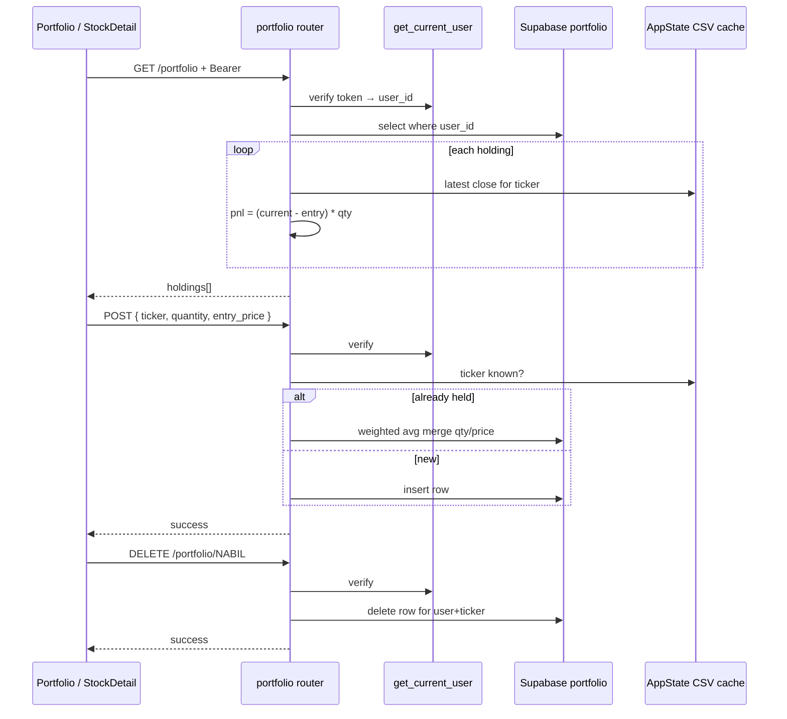

#### G5. Auth endpoints (short)

| Endpoint | Works how |
|----------|-----------|
| `POST /auth/signup` | Supabase creates user → trigger inserts `profiles` → returns tokens + user |
| `POST /auth/login` | Supabase password grant → tokens + user |
| `POST /auth/refresh` | Exchange refresh → new access/refresh |
| `GET /auth/me` | JWT → load `profiles` row |

#### G6. Stock detail supporting reads

| Endpoint | Works how |
|----------|-----------|
| `GET /stocks/{t}/ohlc` | Cached DataFrame → optional date filter → OHLC JSON |
| `GET /stocks/{t}/summary` | Last row + ~252-day high/low/avg volume |
| `GET /stocks/{t}/indicators` | Compute RSI/MACD/BB/EMA on close series → latest values |
| `GET /health` | Counts + `get_latest_data_date()` sample for Header badge |
| `GET /models` | All `models` table rows + `stale` flag |
| `GET /model_status/{t}` | trained / training / not_available |

---

### H. ML pipeline diagram (train vs predict)

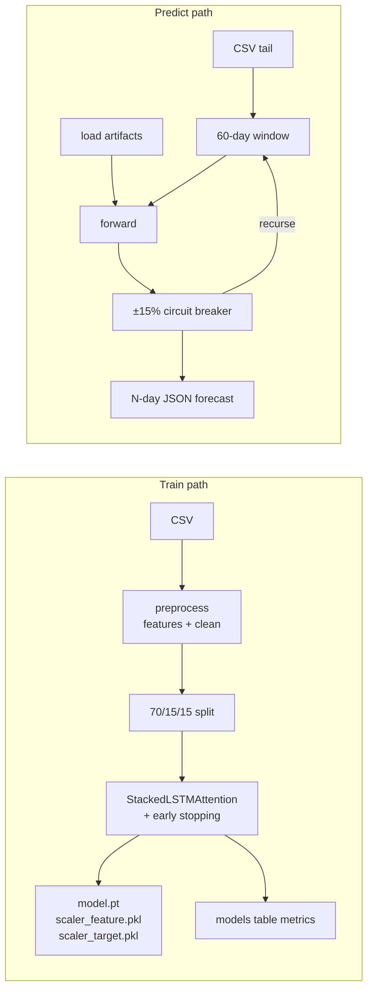

---

### I. Deployment / runtime topology

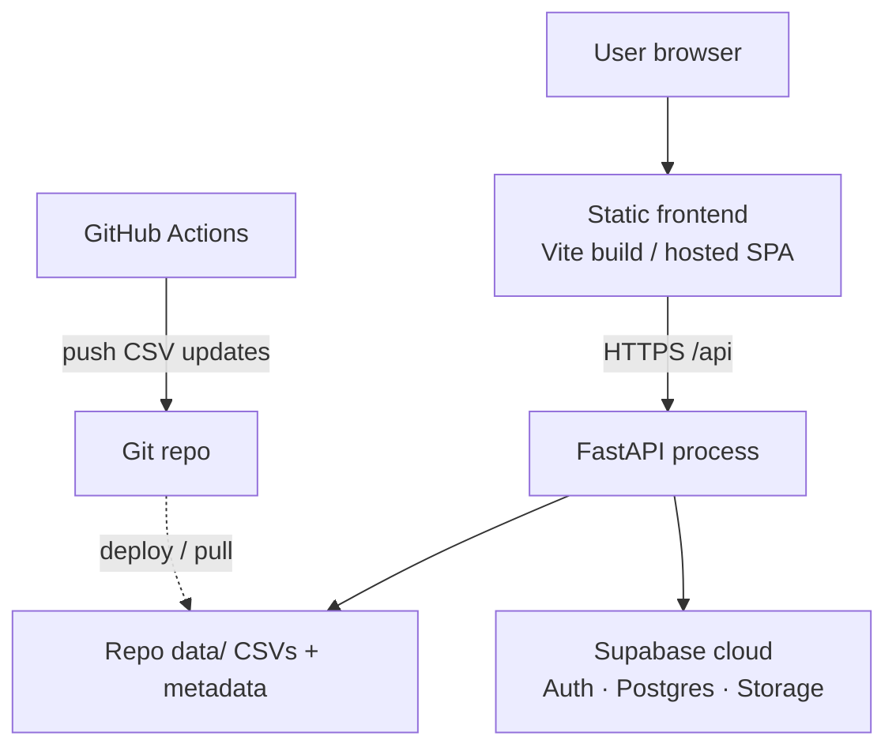

---

## 3. Frontend — how it is organized

**Stack:** React 19 + TypeScript + Vite 8 + React Router v7 + Zustand + Axios + Tailwind 4 + TradingView Lightweight Charts + GSAP.

### Entry flow

1. `index.html` loads `src/main.tsx`
2. `main.tsx` mounts `<App />`
3. `App.tsx` sets up:
  - Router
  - Theme init
  - Auth init (`useAuthStore.initialize`)
  - Toast container + session-expired handler
  - Routes


### Routes


| Path             | Page              | Auth?     |
| ---------------- | ----------------- | --------- |
| `/login`         | Login / Sign up   | Public    |
| `/`              | Dashboard         | Protected |
| `/gainers`       | Full gainers list | Protected |
| `/losers`        | Full losers list  | Protected |
| `/stock/:ticker` | Stock detail + AI | Protected |
| `/portfolio`     | Holdings          | Protected |
| `/watchlist`     | Personal watchlist| Protected |
| `/compare`       | Stock comparison  | Protected |
| `*`              | Redirect to `/`   | —         |


**Protected routes:** wrapped in `ProtectedRoute`. If no user after init → redirect to `/login`. Layout for logged-in pages is `AppLayout` = `Sidebar` + page content (`<Outlet />`).

### Folder map (`frontend/src/`)


| Folder                | What it is                                 | Interview one-liner                              |
| --------------------- | ------------------------------------------ | ------------------------------------------------ |
| `pages/`              | Full screens (Dashboard, StockDetail, …)   | “Route-level containers that compose widgets.”   |
| `components/layout/`  | Sidebar, Header, ProtectedRoute            | “Chrome shared across pages.”                    |
| `components/ui/`      | Button, Card, Modal, Spinner…              | “Reusable presentational primitives.”            |
| `components/widgets/` | MarketOverview, TickerList, StockSearch…   | “Dashboard pieces that read global stock state.” |
| `components/cards/`   | AIPrediction, CurrentSnapshot, chart tabs… | “Feature cards used on stock/portfolio pages.”   |
| `components/charts/`  | Candlestick, volume, overlays              | “Thin wrappers around Lightweight Charts.”       |
| `hooks/`              | `useStockData`, `usePrediction`, …         | “Data-fetching logic extracted from pages.”      |
| `store/`              | Zustand stores                             | “Client global state (auth, tickers, theme…).”   |
| `services/api.ts`     | Axios client + API helpers                 | “Single place for all HTTP calls.”               |
| `types/`              | TypeScript interfaces                      | “Contracts matching backend JSON.”               |
| `utils/`              | Formatters, chart helpers, error parsing   | “Pure helpers, no React.”                        |
| `config/env.ts`       | `VITE_API_URL` etc.                        | “Typed env access.”                              |


### State management (Zustand)


| Store            | Holds                                      | Why not React Context?                                               |
| ---------------- | ------------------------------------------ | -------------------------------------------------------------------- |
| `authStore`      | User, access/refresh tokens, session flags | Persisted to `localStorage` (`nepai-auth`); needed everywhere.       |
| `stockStore`     | All tickers list, loading, `dataUpdatedTo` | Shared by Dashboard / Movers / Portfolio search; 5‑min client cache. |
| `portfolioStore` | Holdings CRUD helpers                      | Shared between Portfolio page and StockDetail “Add”.                 |
| `watchlistStore` | User's watchlist tickers (max 20)          | Persisted to `localStorage`; shared across Watchlist and StockDetail.|
| `themeStore`     | Light/dark                                 | Persisted; applies CSS class on `<html>`.                            |
| `toastStore`     | Toast queue                                | Fire-and-forget notifications from anywhere.                         |


**Pattern:**

- **Global / shared / cached** → Zustand store  
- **Page-specific fetch** (one ticker’s OHLC, prediction) → custom hook with `useState` + `useEffect`


### How the frontend talks to the backend

1. `VITE_API_URL` defaults to `/api` (`config/env.ts`).
2. In **dev**, Vite proxies `/api` → `http://localhost:8000` (`vite.config.ts`). Browser thinks it’s same-origin; no CORS pain locally.
3. In **prod**, set `VITE_API_URL` to the real API base (e.g. `https://your-api.onrender.com/api`).
4. All calls go through Axios instance in `services/api.ts`:
  - Request interceptor: attach `Authorization: Bearer <accessToken>`
  - Response interceptor: on `401`, try refresh once, retry original request; if refresh fails → session expired modal

Grouped helpers:


| Helper          | Backend endpoints                                           |
| --------------- | ----------------------------------------------------------- |
| `authAPI`       | `/auth/signup`, `/login`, `/refresh`, `/me`                 |
| `stockAPI`      | `/stocks`, `/ohlc`, `/summary`, `/indicators`               |
| `predictionAPI` | `/predictions/:ticker`                                      |
| `trainAPI`      | `POST /train`, `/model_status/:ticker`                      |
| `modelAPI`      | `GET /models` (client exists; no dedicated Models page yet) |
| `healthAPI`     | `GET /health` (used for “Data to date” badge)               |
| `portfolioAPI`  | `GET/POST/DELETE /portfolio`                                |


### Page → data flow (examples)

**Dashboard**

1. `loadTickers()` from `stockStore`
2. Calls `GET /stocks` (+ `GET /health` once for latest scrape date)
3. Widgets (`MarketOverview`, `TopMovers`, `TickerList`, `SectorBreakdown`) **derive** gainers/losers/volume from the same ticker array in memory — no extra API calls

**Stock detail (**`/stock/NABIL`**)**

1. `useStockData` → OHLC + summary
2. `usePrediction` → forecast (or empty if no model)
3. `useIndicators` → RSI/MACD/BB/EMA
4. Charts + `AIPrediction` + `ModelHealthCard` render that data
5. “Train / Retrain” → `POST /train` → then `refetch` prediction

**Portfolio**

1. `GET /portfolio` with JWT
2. Backend joins holdings with latest CSV close for live P&L
3. Add/remove update Supabase via backend

**Watchlist**

1. User adds up to 20 tickers to `watchlistStore` (persisted in browser).
2. Watchlist page iterates through stored tickers, fetching individual 30-day sparkline/OHLC data and summary using `useWatchlistData` and caching.
3. Provides a quick snapshot without heavy lifting.

**Stock Comparison**

1. Compare page (`/compare`) lets user select 2–5 stocks.
2. Fetches full OHLC history and indicators (RSI, EMA, etc.) for selected stocks concurrently.
3. Normalizes prices into a baseline percentage scale, overlaying all selected stocks onto a single TradingView chart.
4. Renders a side-by-side key metrics table (`CompareTable`) for comparative analysis.


### Auth UX on the frontend

1. Login/signup → tokens + user saved in Zustand (persisted).
2. App reload → `initialize()` calls `/auth/me`; if 401, tries `/auth/refresh`.
3. Mid-session 401 on any API → silent refresh + retry.
4. Refresh fails → clear tokens, show session-expired modal, send user to login.

**Interview tip:** “We use JWT access + refresh. Access token goes on every request; refresh rotates tokens without forcing the user to log in again. Tokens live in persisted Zustand (localStorage) — fine for this app; for higher security you’d prefer httpOnly cookies.”

---


## 4. Backend — how it is organized

**Stack:** Python, FastAPI, PyTorch, pandas, scikit-learn, Supabase Python client.

Run from **repo root**: `python -m backend serve` (not from inside `backend/`).

### Package layout

```
backend/
├── __main__.py          CLI: train | predict | evaluate | serve
├── config.py            Paths + ML hyperparameters
├── supabase_client.py   Single Supabase client (service role)
├── api/
│   ├── main.py          FastAPI app, CORS, routers, /health, startup
│   ├── state.py         In-memory CSV cache, ticker list, training locks
│   ├── metadata.py      Attach company name + sector to responses
│   ├── errors.py        Domain errors → HTTP status codes
│   ├── auth.py          FastAPI Depends: verify JWT → user_id
│   └── routers/         One file per feature area
└── ml/
    ├── model.py         StackedLSTMAttention
    ├── preprocessing.py Load CSV, engineer features, split
    ├── dataset.py       Sliding windows for DataLoader
    ├── training.py      Train loop, early stop, save
    ├── inference.py     Recursive multi-day predict
    ├── evaluation.py    MAE, RMSE, MAPE, R², direction accuracy
    ├── circuit_breaker.py  ±15% daily cap (NEPSE rule)
    └── storage.py       Upload/download model to Supabase + local cache
```


### What each API area does


| Router                    | Used for                | Main inputs            | Talks to                              |
| ------------------------- | ----------------------- | ---------------------- | ------------------------------------- |
| `stocks`                  | Market UI               | ticker, date range     | CSV via `app_state`                   |
| `predictions`             | AI card / chart overlay | ticker, days=1–14      | CSV + model artifacts                 |
| `train`                   | Train/retrain button    | `{ stock_name }`       | CSV + PyTorch + Supabase              |
| `models` / `model_status` | Model list / status     | ticker                 | Supabase `models` table               |
| `auth`                    | Login/signup/me         | credentials / JWT      | Supabase Auth + `profiles`            |
| `portfolio`               | Portfolio page          | JWT + ticker/qty/price | Supabase `portfolio` + CSV prices     |
| `health`                  | Header “Data to …”      | —                      | ticker count, models, max sample date |


### `AppState` (in-memory)

On startup:

1. Load name/sector JSON metadata
2. Scan `data/companies/*.csv` → `available_tickers`
3. Log existing models from Supabase

While running:

- `data_cache`: first read of a ticker loads the CSV into a pandas DataFrame and keeps it in RAM (fast dashboard). Training invalidates that ticker’s cache.
- `training_status`: prevents two simultaneous trains of the same ticker (HTTP 409).
- `get_latest_data_date()`: samples tickers, takes the newest `published_date` (unlisted stocks with older last dates don’t drag the “data as of” badge down if others are newer).


### Auth on the backend

Frontend **does not** use Supabase JS SDK. Backend is an **auth proxy**:


| Endpoint             | What happens                                    |
| -------------------- | ----------------------------------------------- |
| `POST /auth/signup`  | Supabase creates user; trigger fills `profiles` |
| `POST /auth/login`   | Returns access + refresh tokens                 |
| `POST /auth/refresh` | New tokens                                      |
| `GET /auth/me`       | Reads `profiles` for Bearer user                |


Protected routes use:

```python
user_id: str = Depends(get_current_user)
```

`get_current_user` calls `supabase_client.auth.get_user(token)` and returns the UUID (or 401).

### Portfolio logic (simple)

- Stored in Supabase: `user_id`, `ticker`, `quantity`, `entry_price`
- On **GET**, backend looks up **current close** from CSV cache → computes P&L
- On **POST**, if ticker already held → **weighted average** entry price (WACC-style merge), else insert

Example: 10 shares @ 500 + 5 @ 600 → 15 shares @ 533.33

### Error model

Custom exceptions map to stable JSON like `{ "error": "...", "ticker": "..." }` with codes:


| Code | Meaning                                  |
| ---- | ---------------------------------------- |
| 400  | Bad input / not enough data to train     |
| 401  | Bad/expired JWT or wrong password        |
| 404  | Unknown stock or no model                |
| 409  | Training already running for that ticker |
| 500  | Unexpected / Supabase failure            |


Frontend `getApiErrorMessage` / `formatTrainErrorDisplay` turn these into friendly UI copy.

---


## 5. ML pipeline (simple terms)


### Goal

For one stock (e.g. NABIL), learn from past days and guess **tomorrow’s close**, then repeat that idea for several days ahead.

### Model

**Stacked LSTM + Multi-Head Attention** (~100K parameters **per ticker**).

Why per ticker? Each NEPSE stock has different price scale and behavior; separate model + separate scalers is simpler and often more accurate than one giant multi-stock model for this project size.

Rough flow:

```
60 days of 10 features
  → project to hidden size
  → 2-layer LSTM (sequence memory)
  → attention (which past days matter)
  → small fully-connected head
  → one number: next close
```


### Features (10)

OHLC, % change, volume, plus engineered: MA-7, MA-21, volatility, price range.

### Training steps (`POST /train` or CLI)

1. Check CSV exists
2. Check not already training
3. Preprocess; require ≥ 500 rows (from 2020+)
4. Delete old model artifacts
5. Train in a **background thread** (`asyncio.to_thread`) so other API requests still work
6. Save:
  - weights + scalers → Supabase Storage bucket `model-artifacts`
  - metrics/metadata → Supabase table `models`
  - optional local cache under `backend/.model_cache/`


### Inference (prediction)

1. Load model + scalers
2. Take last 60 days
3. Predict day 1
4. Apply **±15% circuit breaker** (NEPSE daily move limit)
5. Feed prediction back into the window (recursive) for day 2…N
6. Skip weekends when assigning dates

Returns JSON the frontend shows in `AIPrediction` and optionally overlays on the chart.

### “Stale” model

If `date_created` is older than **7 days** (`STALE_DAYS` in `state.py`), API marks `stale: true`. UI can warn; user can still retrain anytime.

---


## 6. End-to-end journeys (interview stories)


### A. “User opens the dashboard”

1. Already logged in → tokens in localStorage
2. `ProtectedRoute` allows access
3. Dashboard calls `loadTickers` → `GET /api/stocks`
4. Backend walks CSVs (cached), returns latest close/change/volume/date per ticker
5. Frontend computes gainers/losers/sentiment in the browser
6. Header shows “Data to YYYY-MM-DD” from `/health`


### B. “User opens stock NABIL and sees AI forecast”

1. Parallel: OHLC, summary, indicators, predictions
2. If model missing → “Train Model” UI
3. If model exists → day-by-day prices + Model Health card
4. Retrain → long `POST /train` → refetch prediction


### C. “User adds NABIL to portfolio”

1. Modal sends quantity + entry price
2. `POST /api/portfolio` with Bearer token
3. Backend verifies JWT, upserts row (weighted avg if exists)
4. Portfolio page later shows live P&L using latest CSV close


### D. “Nightly data update”

1. GitHub Action runs scraper Mon–Fri ~18:00 NPT
2. CSVs in `data/companies/` updated and committed
3. Deployed backend (or local after pull) serves newer dates
4. UI “Data to …” reflects the newest dates in the files

---


## 7. Frontend ↔ backend connection map


| UI piece               | Hook / store               | HTTP                     | Backend module                       |
| ---------------------- | -------------------------- | ------------------------ | ------------------------------------ |
| Login form             | `authStore`                | `/auth/login`, `/signup` | `routers/auth.py`                    |
| Session restore        | `authStore.initialize`     | `/auth/me`, `/refresh`   | `routers/auth.py`                    |
| Dashboard market cards | `stockStore`               | `/stocks`, `/health`     | `stocks.py`, `main.py`               |
| Ticker search / table  | `stockStore`               | `/stocks`                | `stocks.py`                          |
| Stock chart            | `useStockData`             | `/ohlc`, `/summary`      | `stocks.py`                          |
| Indicators panel       | `useIndicators`            | `/indicators`            | `stocks.py`                          |
| AI prediction card     | `usePrediction`            | `/predictions/:t`        | `predictions.py` → `ml/inference.py` |
| Train / Retrain        | `AIPrediction`             | `POST /train`            | `train.py` → `ml/training.py`        |
| Portfolio              | `usePortfolio` / store     | `/portfolio`             | `portfolio.py`                       |
| Header data badge      | `stockStore.dataUpdatedTo` | `/health`                | `state.get_latest_data_date`         |
| Theme toggle           | `themeStore`               | *(none)*                 | client-only                          |


---


## 8. Data & secrets — what lives where


| Thing                   | Where                                      | Who can see it                        |
| ----------------------- | ------------------------------------------ | ------------------------------------- |
| OHLC CSVs               | Git repo `data/companies/`                 | Public if repo public; served via API |
| Company names / sectors | `data/metadata/*.json`                     | Via API enrichment                    |
| User passwords          | Supabase Auth (hashed)                     | Never in your DB as plain text        |
| JWT tokens              | Browser localStorage (via Zustand persist) | User’s browser                        |
| Service role key        | `backend/.env` only                        | Server only — **never** `VITE_`*      |
| Model `.pt` files       | Supabase Storage + `.model_cache`          | Server downloads them for inference   |
| Model metrics           | Supabase `models` table                    | Via `/models`, prediction metadata    |


---


## 9. Design / UX notes (frontend interview)

- **SPA:** one HTML shell; client-side routing — fast navigations after first load.
- **Protected shell:** Sidebar always present when logged in; Header is per-page (title/actions differ).
- **Responsive:** desktop sidebar; mobile top brand bar + bottom nav.
- **Theme:** CSS variables (`dt-`* tokens); charts pick colors from theme helpers.
- **Animations:** GSAP entrance hooks; respect `prefers-reduced-motion`.
- **Charts:** TradingView Lightweight Charts — efficient for financial time series; overlays for predictions/indicators are separate series.

---


## 10. Interview Q&A (simple answers)


### Frontend

**Q: Why Axios instead of fetch?**  
A: Interceptors for auth headers and 401→refresh→retry in one place; consistent error objects.

**Q: Why Zustand over Redux?**  
A: Small app, little boilerplate; persist middleware for auth/theme; selective subscriptions avoid extra re-renders.

**Q: Why custom hooks for stock/prediction?**  
A: Encapsulate loading/error/refetch per ticker without polluting global store with every stock’s full history.

**Q: How do you avoid CORS in development?**  
A: Vite proxy: browser calls `/api` on port 5173; Vite forwards to FastAPI on 8000.

**Q: How is TypeScript used?**  
A: Shared `types/` mirror API JSON so UI props and responses are checked at compile time.

**Q: What happens if the access token expires mid-request?**  
A: Interceptor refreshes once, retries; if refresh fails, session-expired flow.

### Backend / fullstack

**Q: Why FastAPI?**  
A: Fast to write, automatic OpenAPI docs (`/docs`), async-friendly, easy `Depends` for auth.

**Q: Why not train in the browser?**  
A: PyTorch + GPU/CPU training is heavy; models and secrets belong on the server.

**Q: Why one model per stock?**  
A: Different price scales and patterns; per-stock RobustScalers; simpler ops for this scope.

**Q: What is recursive prediction?**  
A: Model only trained for next day. For day 2 we pretend day 1’s prediction happened, rebuild features, predict again, etc.

**Q: What is the circuit breaker?**  
A: NEPSE limits daily moves (~±15%). We clamp each predicted step so forecasts stay market-realistic.

**Q: How do you keep the API alive while training?**  
A: `asyncio.to_thread` runs training off the event loop; other requests still served. Same ticker can’t train twice (409).

**Q: How is portfolio P&L calculated?**  
A: DB stores cost basis; live price comes from latest CSV close; P&L = (current − entry) × qty.

**Q: Where is business logic vs UI logic?**  
A: Auth, ML, portfolio math, indicators → backend. Sorting gainers, pagination, chart period filters → frontend.

**Q: How would you scale this?**  
Possible answers: cache `/stocks` responses (Redis), precompute indicators, queue training (Celery/RQ), CDN for frontend, read replicas, don’t load all CSVs into one process forever.

### ML (light)

**Q: What is LSTM?**  
A: A neural net good at sequences — remembers patterns over many days of prices.

**Q: Why attention?**  
A: Helps the model weigh which past days matter more for the next close.

**Q: Why RobustScaler?**  
A: Stock prices have outliers; robust scaling uses median/IQR and is less sensitive than standard scaling.

**Q: Metrics you care about?**  
A: MAE/RMSE/MAPE (how far off), R² (fit), **direction accuracy** (up/down correctness — often what traders care about).

---


## 11. Mental model cheat sheet


| If someone asks…                           | Point to…                                                 |
| ------------------------------------------ | --------------------------------------------------------- |
| “Where is the UI?”                         | `frontend/src/pages` + `components`                       |
| “Where are API calls?”                     | `frontend/src/services/api.ts`                            |
| “Where is login state?”                    | `frontend/src/store/authStore.ts`                         |
| “Where are routes registered?”             | `frontend/src/App.tsx`                                    |
| “Where is the FastAPI app?”                | `backend/api/main.py`                                     |
| “Where is JWT checked?”                    | `backend/api/auth.py`                                     |
| “Where is training?”                       | `backend/api/routers/train.py` + `backend/ml/training.py` |
| “Where is prediction?”                     | `backend/ml/inference.py`                                 |
| “Where are prices?”                        | `data/companies/*.csv`                                    |
| “Where are users/portfolio/models stored?” | Supabase                                                  |


---


## 12. Frontend Component & File Glossary

A detailed breakdown of every key file in `frontend/src/`.

### `pages/` (Route Containers)
- `Dashboard.tsx`: Main landing page after login. Renders MarketOverview, SectorBreakdown, TopMovers, TickerList.
- `Login.tsx`: Handles user authentication (login/signup) using Supabase Auth endpoints.
- `MoversPage.tsx`: Full list of top gainers or losers based on the latest market trading day.
- `Portfolio.tsx`: Displays user holdings, P&L, and overall portfolio value.
- `StockDetail.tsx`: Detailed view of a single stock. Shows price charts, indicators, AI predictions, and model health.
- `WatchlistPage.tsx`: Compact dashboard of user's favorited stocks with 30-day sparklines.
- `ComparePage.tsx`: Allows users to select multiple stocks and compare their percentage growth over time and key metrics.

### `components/cards/` (Feature Blocks)
- `AIPrediction.tsx`: Renders the next 1-14 days forecasted prices using the LSTM model. Contains the "Train Model" logic.
- `CompareTable.tsx`: Side-by-side tabular comparison of selected stocks (Price, Change, 52W High/Low, RSI, EMA 20).
- `CurrentSnapshot.tsx`: Quick summary card of a stock's latest close, 52W range, and volume.
- `ExportModal.tsx`: Modal for exporting portfolio data.
- `HistoricalDataTable.tsx`: Paginated table view of raw OHLC history for a specific stock.
- `ModelHealthCard.tsx`: Displays training metrics (MAE, RMSE, MAPE, Direction Accuracy, R²) of the currently trained AI model.
- `PortfolioCard.tsx`: Individual holding card showing quantity, entry price, and current P&L.
- `StockChartTabs.tsx`: Tabbed container switching between the main price chart and the historical data table.
- `StockSummaryCard.tsx`: High-level summary card (used in watchlists or dashboard context).
- `TechnicalIndicators.tsx`: Panel showing calculated indicators (RSI, MACD, Bollinger Bands, EMA).
- `WatchlistRow.tsx`: A single row in the watchlist displaying a sparkline chart and quick actions.

### `components/charts/` (Lightweight Charts Wrappers)
- `CandlestickChart.tsx`: Renders OHLC data using lightweight-charts.
- `CompareChart.tsx`: Renders multiple stock price lines normalized to percentage change.
- `HistoricalPriceChart.tsx`: Simple line chart for historical close prices.
- `IndicatorOverlay.tsx`: Overlays technical indicators on top of the candlestick chart.
- `PredictionOverlay.tsx`: Overlays the AI's predicted price path.
- `SparklineChart.tsx`: Minimalist line chart used in Watchlist for 30-day trends.
- `VolumeChart.tsx`: Renders the daily trading volume histogram below the price chart.

### `components/widgets/` (Reusable Dashboard Pieces)
- `LiveClock.tsx`: Displays the current ticking time.
- `MarketOverview.tsx`: Top-level dashboard stats (Gainers, Losers, Listed, Total Volume).
- `MoversList.tsx`: Tabular list of top gainers/losers for the MoversPage.
- `PortfolioSummary.tsx`: Aggregated total value and total P&L of the entire portfolio.
- `SectorBreakdown.tsx`: Visual progress bar showing the distribution of gainers vs losers vs unchanged.
- `StockSearch.tsx`: Autocomplete search bar for quickly navigating to a stock.
- `StockTickerTooltip.tsx`: Hover tooltip showing company full name and sector.
- `TickerList.tsx`: Complete paginated table of all listed stocks on the dashboard.
- `TopMovers.tsx`: Panel showing the top 5 gainers and losers.

### `components/layout/` & `components/ui/` (Globals & Primitives)
- **Layout:** `Sidebar.tsx`, `Header.tsx`, `ProtectedRoute.tsx`, `PageWrapper.tsx` manage the app's structural shell.
- **UI:** Reusable design system primitives like `Button.tsx`, `Card.tsx`, `Modal.tsx`, `Spinner.tsx`, `ThemeToggle.tsx`, `Toast.tsx`.

### `store/` (Zustand Global State)
- `authStore.ts`: Manages JWT tokens and user session persistence.
- `portfolioStore.ts`: Manages user holdings and portfolio state.
- `stockStore.ts`: Caches the global list of tickers, market updates, and latest market date.
- `themeStore.ts`: Handles dark/light mode toggling.
- `toastStore.ts`: Global toast notification queue.
- `watchlistStore.ts`: Manages the user's saved tickers (max 20) in localStorage.

### `hooks/` (Custom React Hooks)
- **Data Fetching:** `useStockData`, `usePrediction`, `useIndicators`, `useCompareData`, `useWatchlistData`, `usePortfolio`.
- **Utils:** `useAnimations` (GSAP), `useChartHeight` (responsive charting), `useMediaQuery` (screen size detection).

---

## 13. Backend Component & File Glossary

A detailed breakdown of every key file in `backend/`.

### `api/routers/` (FastAPI Endpoints)
- `auth.py`: Handles `/login`, `/signup`, `/refresh`, and `/me`. Interfaces directly with Supabase Auth.
- `model_status.py`: Returns whether a stock has a trained model and its staleness.
- `models.py`: Lists all currently trained models in the system.
- `portfolio.py`: CRUD endpoints for user holdings (`GET`, `POST`, `DELETE`).
- `predictions.py`: Handles `/predictions/{ticker}` by loading the PyTorch model and executing recursive inference.
- `stocks.py`: Serves `/stocks`, `/ohlc`, `/summary`, and `/indicators`. Uses the in-memory pandas dataframe cache.
- `train.py`: Triggers the async background training thread (`POST /train`).

### `api/` (Core App Infrastructure)
- `main.py`: FastAPI application entry point. Sets up CORS, exception handlers, and includes all routers.
- `state.py`: Manages the `AppState` class (in-memory caching of CSV data, tracking active training locks).
- `metadata.py`: Helper to attach rich company metadata (Sector, Full Name) to ticker symbols.
- `errors.py`: Custom HTTP exceptions for clean error handling.

### `ml/` (Machine Learning Pipeline)
- `model.py`: Defines the `StackedLSTMAttention` PyTorch neural network architecture.
- `preprocessing.py`: Loads CSVs, engineers features (moving averages, RSI, volatility), and scales data using `RobustScaler`.
- `dataset.py`: Converts pandas dataframes into PyTorch tensors using sliding windows (Sequence Dataset).
- `training.py`: The core training loop. Handles backpropagation, loss calculation, early stopping, and saving weights.
- `inference.py`: Executes the trained model recursively over `n` days to forecast future prices.
- `evaluation.py`: Computes MAE, RMSE, MAPE, R², and Directional Accuracy on the validation set.
- `circuit_breaker.py`: Enforces the NEPSE ±15% daily movement limit on AI predictions.
- `storage.py`: Uploads and downloads model artifacts (`.pt` files, scalers) to/from Supabase Storage.

### Root Level
- `__main__.py`: CLI tool for running the server (`serve`), or triggering train/predict from the command line.
- `config.py`: Centralized configuration (hyperparameters, paths, feature lists).
- `supabase_client.py`: Initializes the Supabase python client with the service role key.

---

## 14. Related docs

| File                                             | Use when                                |
| ------------------------------------------------ | --------------------------------------- |
| [README.md](README.md)                           | Project overview + model hyperparams    |
| [frontend/README.md](frontend/README.md)         | Frontend setup, pages, scripts          |
| [backend/README.md](backend/README.md)           | API reference, Supabase SQL, ML modules |
| [nepai-lstm-train.ipynb](nepai-lstm-train.ipynb) | Training experiments notebook           |

---

## 15. Master question bank — Sept 10 discussion

**Product context:** AI Counselor (frontend, admin panel, website)  
**Walkthrough project:** NepAI  
**How to use:** Questions are grouped by the company's stated discussion areas, then by project depth, then by difficulty.

- **[High]** = very likely given the brief  
- **[Med]** = plausible follow-up  
- **[Gap]** = probes FastAPI/Supabase vs Node/Express/MongoDB — answer with a bridge, not a dodge  

Answers below are written in first person so you can rehearse them. Adjust wording to your voice; keep the facts.

---

### Part 1 — General questions by job-description area

#### A. GitHub / project work, architecture & code quality

**[High] Walk me through your GitHub — which project best represents your engineering ability, and why?**  
NepAI. It is a full product loop, not a CRUD demo: React dashboard, FastAPI API, JWT auth proxy, portfolio with live P&L, and a real ML train/predict pipeline with per-stock models, circuit-breaker constraints, and automated NEPSE data scraping. It shows how I structure a mid-size frontend, how I keep secrets on the server, and how I ship something end users can actually open and use.

**[High] Pick one project and explain the architecture end-to-end: client → server → data layer → deployment.**  
Browser runs a React SPA (Vite). All traffic goes to `/api/*` on FastAPI. FastAPI reads OHLC CSVs for market data, runs PyTorch for train/predict, and uses Supabase for Auth, `profiles`, `portfolio`, `models` metadata, and Storage for `.pt`/scaler artifacts. Frontend never holds the service role key. Dev: Vite proxies `/api` → localhost:8000. Prod: static frontend + hosted API; scraper updates CSVs via GitHub Actions.

**[Med] What's a design decision you'd reconsider, and what would you do instead?**  
Storing JWTs in Zustand + localStorage is convenient for an SPA, but for anything handling sensitive counselor-style data I'd move to httpOnly cookies (or BFF) to cut XSS token theft. Also, training in a thread inside the API process works for demos; for production I'd put training on a job queue so a long train cannot starve the web workers.

**How do you decide when to introduce a new abstraction vs keeping code inline?**  
I extract when the same pattern appears twice, or when a page becomes hard to read because of fetch/loading/error noise. In NepAI: Axios lives in `services/api.ts`; auth lives in `authStore`; one-ticker fetches stay in hooks (`useStockData`, `usePrediction`). I do *not* invent a store for data only one screen needs.

**How do you structure a mid-size frontend?**  
`pages/` (routes), `components/{ui,layout,widgets,cards,charts}`, `hooks/`, `store/`, `services/`, `types/`, `utils/`, `config/`. UI primitives stay dumb; widgets/cards own feature composition; stores own shared client state; services own HTTP.

**What does “good code quality” mean, concretely?**  
One convention I enforce: a single API surface (`api.ts`) with typed responses — no scattered `fetch`/`axios` calls in random components. Errors from the backend stay shaped (`{ error, ticker? }`) so the UI can map them consistently.

**Show code you're proud of / one you'd rewrite.**  
Proud: the Axios 401 → silent refresh → retry interceptor wired to `authStore` — one place, all routes benefit. Rewrite with another day: more aggressive chart data windowing / virtualization for very long OHLC histories, and clearer separation of “prediction loading” vs “training in progress” UX.

**Environment variables and secrets — dev vs prod?**  
Frontend only gets `VITE_*` (e.g. `VITE_API_URL`). Backend `.env` holds `SUPABASE_URL` + service role key — never prefixed for the browser. Dev proxy uses `DEV_API_PROXY`. Prod build bakes public API URL; secrets stay on the server host.

**Team / code review / conflicts?**  
I prefer small PRs, clear commit messages, and resolving conflicts by understanding both sides of the route/store change rather than blind “accept theirs.” Even solo, I treat README + typed API contracts as the review surface.

**Testing — what and why?**  
Vitest + Testing Library for utils (formatters, colors), stores, and UI primitives (Button, Spinner, Toast). I cover pure logic and auth/toast edge cases first — highest bug density for least setup — not every chart pixel.

---

#### B. Frontend fundamentals — React / Next.js

**[High] React vs Next.js — when which?**  
React (Vite SPA) when the app is mostly authenticated dashboard UI, charts, and client routing — like NepAI. Next.js when I need SEO/marketing pages, SSR/SSG, or server-first data on first paint. For AI Counselor I'd likely use Next: public marketing site + App Router for SEO, and a client-heavy chat shell for the authenticated product.

**[High] Client vs Server Components (App Router) — how decide?**  
Server by default for static/marketing content and initial data that doesn't need browser APIs. Client when I need hooks, charts, WebSockets/streaming UI, theme toggle, or interactive forms. Pattern: server layout/page fetches; small client islands for chat input and live tokens.

**Controlled vs uncontrolled inputs?**  
I default to controlled for auth/portfolio forms — one source of truth, easy validation and disable states. Uncontrolled (or refs) for simple one-off fields or file inputs when I don't need live validation.

**[High] Local state vs Context vs Zustand/Redux?**  
Local `useState` for form fields and modal open. Custom hooks for per-page fetch lifecycle. Zustand for cross-route concerns (auth, theme, ticker list cache, toasts). Context only for narrow trees (e.g. theme) if I weren't already on Zustand. Redux is overkill unless the team already standardizes on it.

**useEffect pitfalls — examples?**  
- **Stale closure:** interval that reads old `user` because deps omitted — fix with functional updates or correct deps.  
- **Missing deps:** fetching on `ticker` but forgetting `days` in `usePrediction` would serve wrong horizon.  
- **Missing cleanup:** setState after unmount on slow `/predictions` — we use a `cancelled` flag in hooks.

**API call structure?**  
`loading` / `error` / data triad in hooks; Axios interceptors for auth; AbortController (or cancel flag) on unmount; train failures surface structured API errors rather than generic toasts only.

**Debounced search?**  
`StockSearch` typeahead should debounce (e.g. 200–300ms) so we don't refilter/re-render on every keystroke across hundreds of tickers. Debouncing matters because ticker lists are large and filtering is CPU work on the main thread.

**[Med] Accessibility?**  
Semantic buttons/labels, focusable modals, keyboard for primary actions, contrast via theme tokens, `aria-label` on icon-only controls (spinner, theme). For a counselor product I'd prioritize focus traps in modals, clear error announcements, and reduced-motion respect (we already gate GSAP on `prefers-reduced-motion`).

**Responsive approach?**  
Mobile-first Tailwind breakpoints; sidebar on `lg+`, bottom nav on small screens; chart heights via `useChartHeight`; Flex/Grid for dashboard rows.

**Performance?**  
Don't memo by default (React 19 / compiler-friendly). Split heavy chart routes if needed; keep ticker list derived in memory rather than refetching; cache tickers 5 minutes in `stockStore`; avoid putting full OHLC for all stocks in global state.

**Reconciliation / virtual DOM (own words)?**  
React keeps a description of the UI; on state change it diffs that description against the previous one and updates only the DOM nodes that changed — so I think in “state → UI,” not manual DOM writes.

**Form validation?**  
Client for instant UX (required qty/price); server is source of truth (401/400 from FastAPI). Libraries: plain controlled forms here; I'd use React Hook Form + Zod for denser admin forms.

---

#### C. MERN / full-stack basics

**[High] Typical Express route end-to-end?**  
`app.use(cors)` → `json` parser → route-specific `authMiddleware` → controller → service/DB → `res.json` / `next(err)` → centralized error middleware. Conceptually same as FastAPI: middleware/Depends → router → business logic → JSON + status codes.

**[High] One-to-many in MongoDB — embed vs reference?**  
Embed when the child is always loaded with the parent and stays small (e.g. a few portfolio lines on a user doc). Reference when children grow, are queried alone, or are updated independently (sessions, messages). NepAI's portfolio is relational rows today; in Mongo I'd lean **array of holdings on user** until it gets large, then a `holdings` collection keyed by `userId`.

**[High] Auth — JWT vs sessions; cookie vs localStorage?**  
JWT access + refresh (what NepAI uses) scales easily across SPAs. Sessions (server-side store + cookie) are simpler to revoke. **httpOnly cookie** beats **localStorage** for XSS resistance — localStorage is fine for a market demo; for AI Counselor I'd prefer httpOnly + CSRF strategy or a BFF.

**RBAC?**  
Middleware/Depends that reads role from JWT claims or DB; route tables differ by role (`/admin/*` vs `/app/*`). Frontend mirrors with protected routes; backend must still enforce.

**Password hashing / salting?**  
Never store plaintext. bcrypt/argon2 hash with unique salt per user so rainbow tables fail. Supabase Auth does this for NepAI; in Express I'd use bcrypt before insert.

**CORS?**  
Browser blocks cross-origin API calls unless the server sends allowed origins. NepAI FastAPI allows localhost Vite ports. Prod: lock to the real frontend origin, credentials if cookies.

**[Med] Deploy MERN?**  
Frontend Vercel/Netlify; API Render/Railway; Mongo Atlas. Dev: localhost + `.env`; prod: HTTPS, real CORS origins, `NODE_ENV=production`, no debug secrets in client bundle.

**Pagination / filter / sort on REST?**  
Query params: `?page=&limit=&sort=&sector=`. Backend applies limit/offset (or cursor) and returns `{ items, total }`. NepAI currently returns full ticker list and paginates in the UI — fine for ~585 tickers; I'd move server-side if it grew a lot.

**Validation / rate limit?**  
express-validator/Zod on body; rate limit auth and `/train`-like expensive routes. NepAI already rejects bad train payloads and concurrent train (409).

**MongoDB index?**  
Index fields you filter/sort often (`userId` on holdings, `ticker` unique on models). Without indexes, large collections scan every document.

---

#### D. Product thinking — AI Counselor (frontend, admin, website)

**[High] Chat/consultation screens/states?**  
Empty (first-time CTA + safety disclaimer), composing, streaming/in-progress, error/retry, session history list, session detail, “session ended / escalate to human,” and offline/unavailable. Mirror NepAI's loading/error/empty patterns but for conversation turns.

**[High] Admin panel first?**  
Users (active/new), live/recent sessions, **flagged conversations**, usage (messages/day, latency), model/prompt version. Ops needs triage before vanity charts.

**[High] Role-based views?**  
End user: chat + history. Counselor/admin: queue, flags, user lookup, export with audit. Routing: `/` marketing, `/app/*` user JWT, `/admin/*` role claim checked on **server**. NepAI today is single-role authenticated app — Counselor needs an extra role gate.

**Onboarding first-time AI counselor?**  
Short trust copy, what AI can/can't do, crisis resources, consent to store chats, optional goals, then a gentle first prompt — not a blank intimidating textarea.

**[Med] Sensitive personal context — UI + logging?**  
Minimize PII in client logs; redact in admin views by default; retention policy; no training on raw chats without consent; careful toast/error text that doesn't echo secrets. NepAI's “secrets on server only” principle applies harder here.

**Public website vs authenticated app?**  
Next.js: marketing routes SSR/SSG for SEO; `/app` and `/admin` client-heavy and auth-gated. Separate layouts so nav/SEO metadata don't leak into the product shell.

**[Med] Stream tokens vs wait for full reply?**  
Stream for perceived speed and interruptibility; trade-off is more complex UI (partial markdown, cancel, reconnect) and backend SSE/WebSocket. Full reply is simpler and easier to moderate before show — maybe admin tools use full; user chat streams.

**Admin review flagged conversation?**  
User id (pseudonymized), timestamps, full turn transcript, model version/prompt, flag reason, prior flags, actions (dismiss, warn, ban, escalate), audit trail of who reviewed.

---

#### E. Independent problem-solving & debugging

**[High] Long bug — how you debug?**  
Example pattern from this stack: “No module named backend” — wrong CWD; fix by running from repo root. Or 401 loops — inspect Network tab for refresh failing, then auth store clear. Process: reproduce → isolate layer (UI vs network vs API vs DB) → minimal repro → fix → regression note.

**[High] Unfamiliar error — process?**  
Read full message + stack; check which file/layer; search docs/GitHub issues; binary-search with logs; minimal repro; only then ask with context.

**When to keep digging vs ask?**  
30–60 minutes of structured tries without progress, or when I'm blocked on credentials/infra I don't own — then ask with what I already ruled out.

**DevTools?**  
Network: status, payload, auth header. React DevTools: which store/prop changed. Console for thrown API errors. Application tab for persisted Zustand keys.

**Stack traces?**  
Top frames = where it blew up; walk down to *your* code first; ignore node_modules until you know which library threw.

**Deadline trade-off?**  
Shipped per-stock models + UI retrain instead of a perfect training queue; accepted longer blocking `POST /train` for correctness of the demo path.

---

#### F. Meta / fit

**Why this internship / frontend-MERN?**  
I want to ship product UI in a real team, deepen React patterns, and get stronger on the Node side of full-stack while bringing solid API and product sense from NepAI.

**Hoping to learn?**  
Production Next.js/App Router, design-system discipline, admin UX for sensitive products, and Node/Express day-to-day fluency.

**Initiative without being asked?**  
Examples from NepAI: data-updated badge from `/health`, always-available retrain, prediction loading copy, auth refresh UX — polish that wasn't strictly “draw the chart.”

**Last tech you taught yourself?**  
e.g. Lightweight Charts / Zustand persist / FastAPI Depends — learn by building one vertical slice (login → protected page → one API) then expanding.

**Technical opinion not everyone shares?**  
Backend-as-sole-API (no direct Supabase from client) is worth the extra hop for secrets and consistent auth — especially for apps that might later handle sensitive data.

**[High] Questions for them?**  
What does the first 30 days look like on AI Counselor? How do frontend and backend collaborate on streaming chat? What's the biggest UX risk they worry about with an AI counselor product?

---

### Part 2 — NepAI deep-dive

#### Architecture & system design

**[High] Why frontend never talks to Supabase or PyTorch directly?**  
Service role key and model files must not ship to the browser. One API gives consistent auth, validation, CORS, and a single place for train/predict. UI stays a pure client of JSON.

**[High] Login end-to-end (auth proxy)?**  
Login form → `POST /api/auth/login` → FastAPI → Supabase Auth → returns access + refresh + user → Zustand persist → later requests send Bearer access → protected routes use `get_current_user` → Supabase `get_user(token)`. `/auth/me` loads `profiles`.

**Why six Zustand stores?**  
Different lifetimes and consumers: auth (persisted), theme (persisted), stocks (shared cache), portfolio (mutations), toasts (ephemeral). One mega-store would force unrelated re-renders and muddy persistence rules.

**GitHub Actions scraper?**  
Mon–Fri ~18:00 NPT scrapes prices into `data/companies/*.csv` and commits. If it fails, CSVs go stale; UI “Data to …” date stops advancing; models still predict but on old last rows — ops should alert on Action failure.

**[Gap] Why FastAPI in a MERN-track interview? Translate to Express + Mongo?**  
ML forced Python/PyTorch. The *architecture* is transferable: SPA → REST → auth middleware → services → DB/storage. Express would own routes/middleware; Mongo would store users/portfolio/model metadata; **inference would stay a Python worker** called via HTTP/queue — not inside Express.

#### Frontend

**Why Vite + React Router, not Next?**  
Authenticated dashboard + charts don't need SSR SEO. Vite is simpler deploy (static `dist/`). Trade-off: weaker story for a marketing site; for Counselor I'd add Next for public pages.

**Lightweight Charts + large history?**  
Don't put every ticker's full history in global state; fetch per ticker; period filters (`1M`…`All`) slice client-side from latest date; keep chart series updates incremental. If needed later: downsample or server `from`/`to`.

**[High] Silent refresh on 401 — if refresh fails?**  
Interceptor queues refresh once, retries original request with new access token. If refresh fails → clear tokens, `sessionExpired` true → modal → login. Avoid infinite 401 loops by marking `_retry` and not treating login/refresh routes as session expiry.

**Admin-only route today?**  
Add role on profile/JWT claim; backend Depends rejects non-admin; frontend `ProtectedRoute` variant checks role before rendering `/admin`. Never trust UI alone.

#### Backend, data & ML

**[High] Separate model per stock?**  
Different price scales and regimes; per-ticker RobustScalers; simpler debugging. Cost: N train jobs + N artifacts. Shared model saves compute but needs careful normalization and usually more data engineering — for NEPSE scope, per-stock was the pragmatic accuracy move.

**[High] Ten features — why each?**  
OHLC = raw market state; `% change` = momentum; volume = participation; MA7/MA21 = short/medium trend; volatility = risk/regime; price range = intraday stress. Together they give the LSTM sequence context beyond “last close only.”

**±15% circuit breaker & skip weekends?**  
NEPSE daily move limits — uncapped recursion can explode unrealistically. Weekends aren't trading days, so forecast dates advance to weekdays (holidays still a known simplification).

**≥ ~500 rows?**  
Below that, train/val/test splits and seq_len=60 are statistically thin → overfitting / unstable metrics. API returns 400 insufficient data; UI shows a clear train error.

**[Med] Background thread + 409?**  
Prevents two concurrent trains on the same ticker clobbering artifacts/DB row. Thread keeps the event loop accepting other requests during a long train (still not a full job queue).

**7-day staleness?**  
`is_stale` if `date_created` older than 7 days — UI warns model may be out of date vs fresh CSVs. If never stale, users trust old models after regime changes and scrapes.

**Portfolio P&L & weighted average?**  
P&L = `(current_close − entry_price) × qty` with current from CSV. Add to existing: new entry = `(oldQty×oldPrice + addQty×addPrice) / (oldQty+addQty)`.

**[Med] 500 tickers — redesign?**  
Don't train everything inline on API; queue + workers; store artifacts in object storage (already); schedule nightly for liquid names; cache `/stocks`; maybe shared embeddings model + light adapters later.

#### Trade-offs & what you'd change

**[High] Biggest weakness + fix?**  
Training coupled to the web process (long HTTP, resource contention). Fix: job queue (RQ/Celery/BullMQ + Python worker), status polling/`model_status`, notify on complete.

**Model drift detection?**  
Log prediction vs next actual close; rolling MAE/direction accuracy per ticker; alert when metrics degrade vs training baseline or vs naive baseline.

**[Gap] Migrate to MERN — where does ML live?**  
Express + Mongo for app data/auth; **separate Python inference/train service** (or serverless GPU job). Frontend unchanged except base URL. Auth cookies or JWT still proxied by Express.

---

### Part 3 — Difficulty-tiered (NepAI)

#### Beginner

**One sentence?**  
NepAI predicts NEPSE stock prices with per-ticker LSTM models and lets users explore the market and track a portfolio.

**Stacks?**  
Frontend: React 19, TS, Vite, React Router, Zustand, Axios, Lightweight Charts, Tailwind. Backend: FastAPI, PyTorch, pandas, Supabase.

**Zustand vs Context?**  
Zustand: less boilerplate, selective subscriptions, easy persist for auth/theme. Context is fine for rare global values but re-render and provider nesting get awkward for auth + market + toasts together.

**Own REST vs Supabase from frontend?**  
Own REST: hide secrets, centralize rules, run ML. Direct Supabase: faster prototypes, but service role must never ship, and ML still needs a server.

#### Intermediate

**JWT access+refresh — stored where?**  
Access + refresh in Zustand persist (localStorage). Access on `Authorization` header. Refresh via `/auth/refresh` when access dies. User profile from `/auth/me`. Server verifies JWT with Supabase.

**RobustScaler vs MinMax/Standard?**  
Stock prices and spikes are outlier-heavy; RobustScaler uses median/IQR so a crash day doesn't warp the whole scale.

**Add a new feature (e.g. RSI) without breaking old models?**  
Bump feature list in config; **retrain** affected tickers; version metadata (`n_features`, `feature_cols`). Old artifacts aren't compatible — delete/retrain rather than silently load mismatched tensors.

**Paginate portfolio/watchlist?**  
Server: `limit/offset` or cursor on holdings. Client: virtualize long lists. NepAI portfolio is usually small; ticker table already pages in UI.

#### Advanced

**[High] Nightly retrain without blocking API?**  
Scheduler (Actions/cron) enqueues tickers → worker pool trains → writes Storage + `models` row → API only serves predict/status. Optional: only retrain stale or high-volume names.

**Auto-detect degradation?**  
Nightly job compares yesterday's prediction to actual close; store metrics; alert if direction accuracy or MAE breaches threshold for N days.

**Real-time multi-user (watch parties)?**  
Add WebSocket/SSE gateway; pub/sub (Redis) for price events; presence channels. REST stays for CRUD; realtime is a new plane.

#### Expert / stress-test

**Circuit breaker several days in a row?**  
Predictions pin near ±15% caps → path becomes “max up/down” not informative. Surface `was_capped` to UI; widen uncertainty; or stop extending horizon when capped repeatedly; compare to raw uncapped metrics offline.

**Supabase fully down?**  
Auth/portfolio/models fail; CSV market GETs can still work if API host + files are up. Graceful degradation: read-only public market mode, cached last models on disk (`.model_cache`), clear “auth unavailable” banner. Don't pretend portfolio writes succeeded.

**[High] Prove LSTM beats naive baseline?**  
Report test-set MAE/direction accuracy **vs** baseline “tomorrow = today” (and maybe MA). Use same splits; show capped and raw; if you don't beat naive on direction, you don't ship the model as “edge.”

---

### Part 4 — Bridging the MERN gap

**[High] FastAPI/Supabase projects — Node/Express/Mongo experience? Translate?**  
I'm strongest on typed React and API design; NepAI used Python because of PyTorch. Concepts map 1:1: routers↔Express routes, Depends↔middleware, Supabase Postgres tables↔Mongo collections, Storage↔S3. I'd stand up Express + Mongo for app CRUD quickly and keep ML as a sidecar service — same SPA.

**FastAPI Depends ↔ Express middleware?**  
Both run before the handler: parse auth, attach `userId`, call `next()` or throw 401. FastAPI injects typed params; Express mutates `req`.

**Auth-proxy in Express + Mongo?**  
`POST /auth/login` verifies password (bcrypt) or federated IdP; issue JWT; `authMiddleware` verifies signature; user/profile docs in Mongo; refresh token rotation collection. Same frontend interceptor story.

**[Med] Postgres portfolio → Mongo documents?**  
Option A: `{ userId, holdings: [{ ticker, qty, entryPrice, addedAt }] }`. Option B: `holdings` collection `{ userId, ticker, ... }` with compound index `(userId, ticker)`. Weighted-average merge becomes an update of one array element or one document.

**Comfort picking up Node day one?**  
Yes — I already consume REST from React daily; Express is the same request/response model I use with FastAPI. First week: mirror NepAI's auth + one resource CRUD in Express/Mongo to prove the mapping.

**Prep tip:** Rehearse Part 2 **[High]** answers aloud with the architecture diagram from this doc open. For every **[Gap]** question, lead with *transferable architecture*, then *where Python still belongs* (ML worker) — never apologize for the stack; explain the constraint.

---

*Interview companion section for the Sept 10 discussion. Prefer live code and this guide's earlier architecture sections when details drift.*
