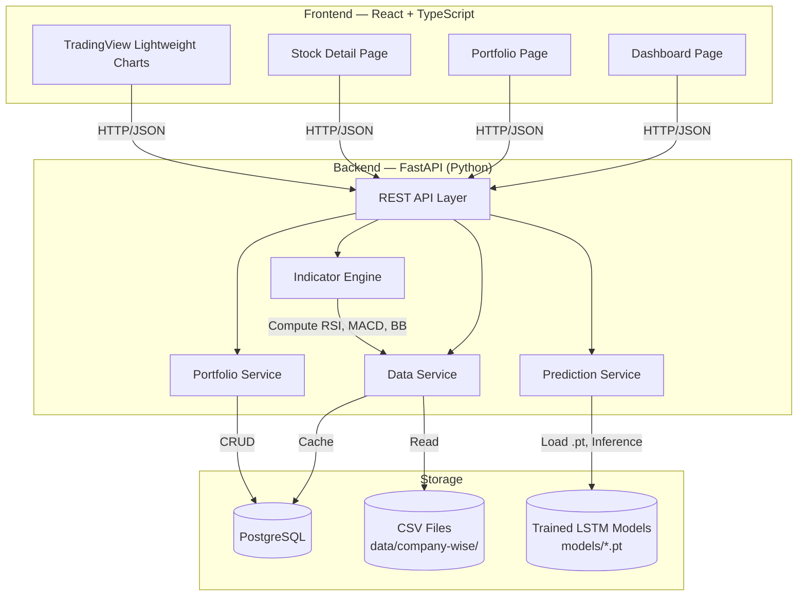
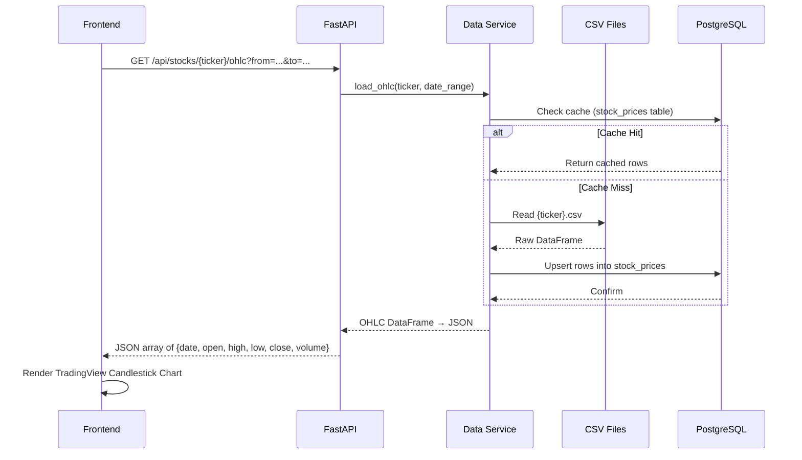
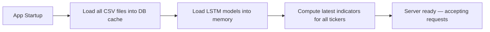
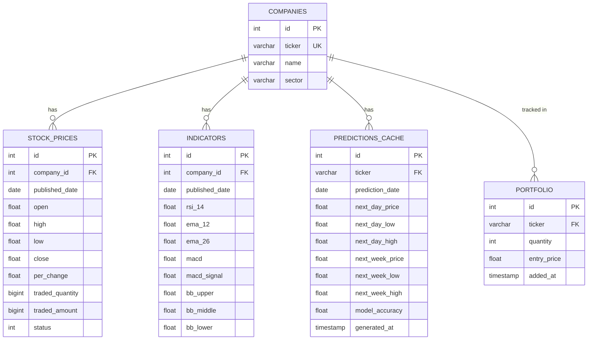
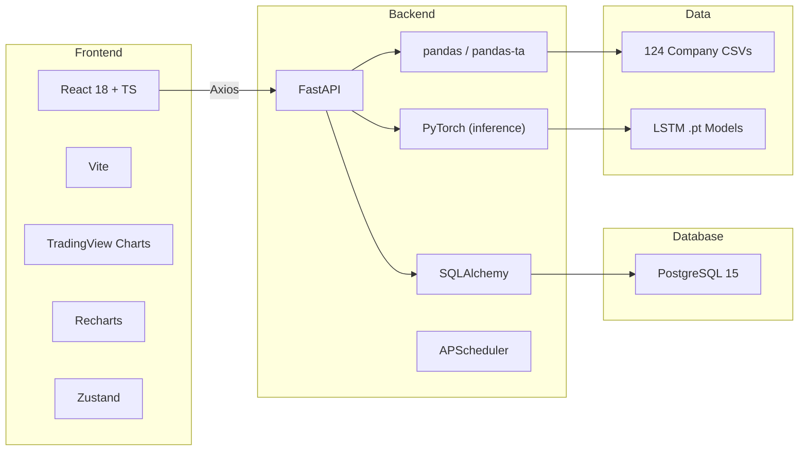

# NepAI — Full-Stack Architecture

> **LSTM-Based Adaptive Stock Price Prediction & Portfolio Intelligence Platform for NEPSE**

---

## 1. Project Summary

NepAI is a single-user financial dashboard that:

1. Ingests **124 company CSV files** from `nepse-data/data/company-wise/` (OHLC + volume + % change).
2. Computes **technical indicators** (RSI, MACD, EMA, Bollinger Bands) server-side.
3. Serves **pre-trained LSTM model predictions** (next-day & next-week close prices) via REST APIs.
4. Renders an **interactive dashboard** with candlestick charts, overlaid indicators, prediction cards, and a portfolio tracker.

> [!IMPORTANT]
> The LSTM model is assumed **already trained and saved** (e.g., `models/<TICKER>.pt`). This architecture does NOT cover model training — only inference.

> [!NOTE]
> Single-user mode: no authentication, no registration, no user table. The portfolio is stored locally or in a single DB row.

---

## 2. High-Level Architecture



---

## 3. Data Flow — CSV → Frontend Visualization

This is the critical path: how raw CSV data reaches the charts.



### Key Decisions

| Decision | Choice | Rationale |
|---|---|---|
| CSV vs. DB as source of truth | **CSV is source of truth**, DB is cache | The scraper writes CSVs; DB accelerates queries & allows date filtering |
| Indicator computation | **Server-side** (Python: `ta-lib` or `pandas-ta`) | Keeps frontend thin; indicators are reusable across endpoints |
| Prediction serving | **On-demand inference** via FastAPI | Pre-trained `.pt` model loaded at startup; predict on latest N rows |
| Chart library | **TradingView Lightweight Charts** | Purpose-built for financial data; free, fast, small bundle |

---

## 4. Backend Architecture

### 4.1 Directory Structure

```
backend/
├── app/
│   ├── __init__.py
│   ├── main.py                  # FastAPI app entry point
│   ├── config.py                # Settings (DB URL, model paths, CSV dir)
│   │
│   ├── routers/
│   │   ├── stocks.py            # /api/stocks/* endpoints
│   │   ├── predictions.py       # /api/predictions/* endpoints
│   │   └── portfolio.py         # /api/portfolio/* endpoints
│   │
│   ├── services/
│   │   ├── data_service.py      # CSV loading, DB caching, OHLC queries
│   │   ├── indicator_service.py # RSI, MACD, EMA, Bollinger Band computation
│   │   ├── prediction_service.py# Load LSTM models, run inference
│   │   └── portfolio_service.py # Portfolio CRUD operations
│   │
│   ├── models/
│   │   ├── db_models.py         # SQLAlchemy ORM models
│   │   └── schemas.py           # Pydantic request/response schemas
│   │
│   └── utils/
│       ├── csv_loader.py        # Read & parse company CSVs
│       └── technical.py         # Indicator math (RSI, MACD, BB, EMA)
│
├── models/                      # Trained LSTM .pt files
│   ├── NABIL.pt
│   ├── NMB.pt
│   └── ...
│
├── requirements.txt
└── alembic/                     # DB migrations
```

### 4.2 API Endpoints

#### Stocks

| Method | Endpoint | Description | Response Shape |
|--------|----------|-------------|----------------|
| `GET` | `/api/stocks` | List all available tickers | `[{ticker, name, sector}]` |
| `GET` | `/api/stocks/{ticker}/ohlc` | OHLC data with date range filter | `[{date, open, high, low, close, volume, per_change}]` |
| `GET` | `/api/stocks/{ticker}/indicators` | Technical indicators for a ticker | `{rsi: [...], macd: {...}, bollinger: {...}, ema: [...]}` |
| `GET` | `/api/stocks/{ticker}/summary` | Latest price, 52-wk high/low, volume | `{latest_close, change, high_52w, low_52w, avg_volume}` |

#### Predictions

| Method | Endpoint | Description | Response Shape |
|--------|----------|-------------|----------------|
| `GET` | `/api/predictions/{ticker}` | Next-day and next-week forecast | `{next_day: {price, confidence_low, confidence_high}, next_week: {...}, model_accuracy: 0.87}` |

#### Portfolio

| Method | Endpoint | Description | Response Shape |
|--------|----------|-------------|----------------|
| `GET` | `/api/portfolio` | Get current portfolio | `[{ticker, quantity, entry_price, current_price, predicted_price, pnl}]` |
| `POST` | `/api/portfolio` | Add stock to portfolio | `{ticker, quantity, entry_price}` |
| `DELETE` | `/api/portfolio/{ticker}` | Remove stock from portfolio | `204 No Content` |
| `GET` | `/api/portfolio/summary` | Aggregated portfolio metrics | `{total_value, total_pnl, top_gainer, top_loser}` |

### 4.3 Startup Lifecycle



> [!TIP]
> Models are loaded once at startup via `@app.on_event('startup')` and held in a dictionary `{ticker: model}`. Inference is then instant (no disk I/O per request).

---

## 5. Database Schema (PostgreSQL)



> [!NOTE]
> `STOCK_PRICES` is populated from CSV files on first load, then updated by the daily scraper. `PREDICTIONS_CACHE` stores the latest predictions to avoid recomputing on every request.

---

## 6. Frontend Architecture

See the dedicated **[frontend.md](file:///c:/Users/Acer/Desktop/NepAI/frontend.md)** for full frontend specification.

### High-Level Summary

| Aspect | Choice |
|---|---|
| Framework | React 18 + TypeScript |
| Build Tool | Vite |
| Routing | React Router v6 |
| State Management | Zustand (lightweight) |
| HTTP Client | Axios |
| Charts | TradingView Lightweight Charts + Recharts |
| Styling | CSS Modules + CSS Custom Properties |
| Pages | Dashboard, Stock Detail, Portfolio |

---

## 7. Tech Stack Summary



---

## 8. Deployment Topology (Development)

```
┌─────────────────────────────────────────────┐
│  Developer Machine                          │
│                                             │
│  ┌──────────┐  :5173   ┌──────────┐  :8000  │
│  │  Vite    │ ◄──────► │  FastAPI  │        │
│  │  Dev     │  proxy   │  Uvicorn  │        │
│  │  Server  │          │           │        │
│  └──────────┘          └─────┬─────┘        │
│                              │              │
│                        ┌─────▼─────┐        │
│                        │PostgreSQL │ :5432   │
│                        │ (Docker)  │        │
│                        └───────────┘        │
│                                             │
│  nepse-data/data/company-wise/*.csv         │
│  backend/models/*.pt                        │
└─────────────────────────────────────────────┘
```

---

## User Review Required

> [!IMPORTANT]
> **Database choice**: The proposal mentions PostgreSQL. Should we proceed with PostgreSQL (requiring Docker or local install), or would SQLite be acceptable for this single-user development scenario?

> [!IMPORTANT]
> **LSTM model format**: Are the trained models saved as PyTorch `.pt` files, or a different format (e.g., ONNX, TensorFlow SavedModel, pickle)? This affects the `prediction_service.py` implementation.

## Open Questions

1. **Model file location**: Where are the trained LSTM `.pt` (or equivalent) model files stored? We assumed `backend/models/<TICKER>.pt`.
2. **Which tickers have trained models?** All 124 companies, or a subset?
3. **Prediction confidence intervals**: Does the LSTM output a single price, or does it provide uncertainty bounds? This affects the prediction card UI.
4. **Real-time updates**: Should the dashboard auto-refresh (WebSocket / polling), or is manual refresh sufficient?

## Verification Plan

### Automated Tests
- Backend: `pytest` for each API endpoint with mock CSV data
- Frontend: Vitest + React Testing Library for component rendering
- E2E: Browser subagent to verify charts render correctly

### Manual Verification
- Load CSV data → verify OHLC chart matches raw CSV values
- Run prediction endpoint → verify response matches expected LSTM output
- Add/remove portfolio items → verify persistence
