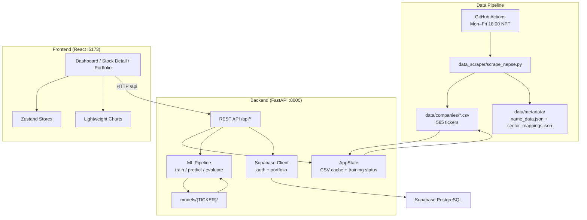
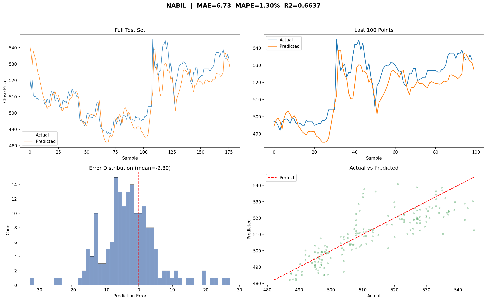
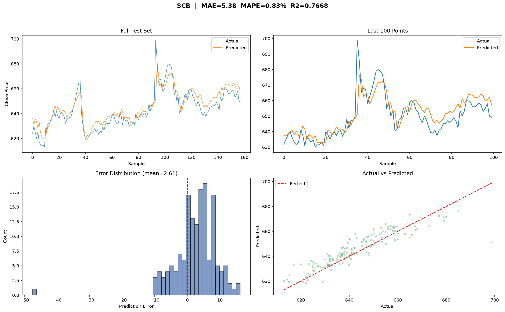
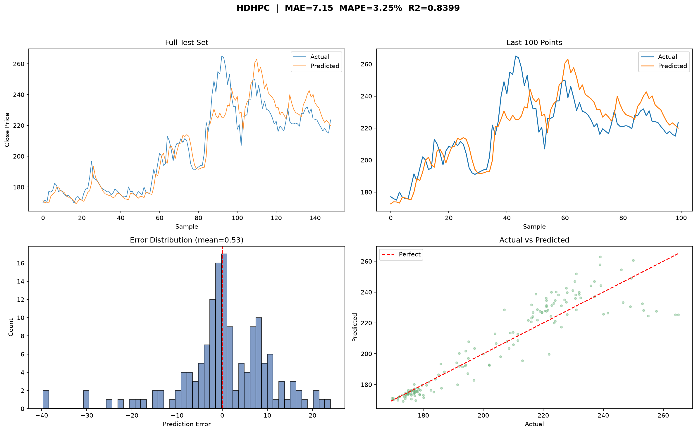

# NepAI — Project Report

**Generated:** June 2026  
**Project:** LSTM-based stock price prediction dashboard for NEPSE (Nepal Stock Exchange)

---

## Table of Contents

1. [Executive Summary](#1-executive-summary)
2. [Project Goals](#2-project-goals)
3. [System Architecture](#3-system-architecture)
4. [Technology Stack](#4-technology-stack)
5. [Data Pipeline](#5-data-pipeline)
6. [Backend](#6-backend)
7. [Frontend](#7-frontend)
8. [Machine Learning Pipeline](#8-machine-learning-pipeline)
9. [Authentication & Database](#9-authentication--database)
10. [Testing](#10-testing)
11. [CI/CD & Automation](#11-cicd--automation)
12. [Project Structure](#12-project-structure)
13. [File Reference](#13-file-reference)
14. [Trained Models & Performance](#14-trained-models--performance)
15. [Screenshots & Visual Assets](#15-screenshots--visual-assets)
16. [Known Limitations](#16-known-limitations)

---

## 1. Executive Summary

NepAI is a full-stack stock analysis and prediction platform built for the Nepal Stock Exchange (NEPSE). The system:

- Collects and maintains **585 stock CSV datasets** updated daily via GitHub Actions
- Trains **per-stock PyTorch LSTM models** with multi-head attention
- Serves **recursive multi-day price forecasts** through a FastAPI REST API
- Provides an authenticated **React dashboard** with charts, predictions, portfolio tracking, and market analytics
- Stores user accounts and portfolios in **Supabase PostgreSQL**

| Metric | Value |
|--------|-------|
| Listed stocks (CSV files) | 585 |
| Trained ML models | 9 |
| Backend Python modules | 23 |
| Frontend source files | ~75 |
| API endpoints | 17 |
| Frontend unit tests | 75 (13 test files) |
| Backend unit tests | 0 |
| Sector categories | 18 |

---

## 2. Project Goals

1. **Data ingestion** — Automatically scrape and version-control daily NEPSE OHLC data
2. **ML forecasting** — Train stock-specific LSTM models that predict next-day close prices
3. **Multi-day inference** — Produce 1–14 day forecasts via recursive prediction with NEPSE circuit-breaker constraints
4. **Interactive dashboard** — Visualize market data, technical indicators, and AI predictions
5. **User portfolios** — Allow authenticated users to track holdings with live P&L
6. **Model lifecycle** — Support on-demand training, staleness detection, and retraining from the UI

---

## 3. System Architecture



### Request flow (stock detail page)

1. Frontend loads OHLC + summary via `/api/stocks/{ticker}/ohlc` and `/api/stocks/{ticker}/summary`
2. Predictions fetched from `/api/predictions/{ticker}`
3. Technical indicators from `/api/stocks/{ticker}/indicators`
4. Full history (on demand) from `/api/stocks/{ticker}`
5. User can trigger training via `POST /api/train`

---

## 4. Technology Stack

| Layer | Technologies |
|-------|-------------|
| **Frontend** | React 19, TypeScript, Vite 8, React Router v7, Zustand, Axios, TradingView Lightweight Charts v5, GSAP, Tailwind CSS 4, Lucide React, Vitest |
| **Backend API** | FastAPI, Uvicorn, Pydantic, pandas, python-dotenv |
| **ML** | PyTorch, scikit-learn (RobustScaler), matplotlib |
| **Auth & DB** | Supabase Auth (JWT), Supabase PostgreSQL (profiles + portfolio tables, RLS) |
| **Data scraping** | BeautifulSoup, Selenium, pandas |
| **CI** | GitHub Actions (scheduled cron) |
| **Storage** | Git-tracked CSV files + filesystem model artifacts |

---

## 5. Data Pipeline

### Stock price data

- **Source:** ShareSansar (NEPSE daily prices)
- **Scraper:** `data_scraper/scrape_nepse.py`
- **Output:** One CSV per ticker in `data/companies/{TICKER}.csv`
- **Schema:**

| Column | Description |
|--------|-------------|
| `published_date` | Trading date |
| `open`, `high`, `low`, `close` | OHLC prices (NPR) |
| `per_change` | Daily percentage change |
| `traded_quantity` | Volume |
| `traded_amount` | Total traded value |
| `status` | Trading status |

- **Count:** 585 ticker files
- **Date range example (NABIL):** 2011-05-15 → 2026-06-12 (3,562 rows); ML training filters to rows from **2020+**

### Company metadata

| File | Purpose |
|------|---------|
| `data/metadata/name_data.json` | Maps ticker → `{ name, sector_id }` (585 entries) |
| `data/metadata/sector_mappings.json` | Maps sector ID → label (18 sectors: Commercial Bank, Hydropower, Life Insurance, etc.) |

Metadata is loaded at backend startup and attached to all API responses as `stock_name` and `stock_sector`.

### Company details scraper

- **Script:** `data_scraper/scrape_details.py`
- Fetches company name and sector for newly listed tickers

---

## 6. Backend

### Package layout

```
backend/
  __main__.py          CLI entry (train, predict, evaluate, serve)
  config.py            Paths, hyperparameters, feature lists, circuit cap
  requirements.txt     Python dependencies
  .env.example         Supabase credential template
  api/
    main.py            FastAPI app, CORS, router registration
    state.py           In-memory CSV cache, ticker list, training status
    metadata.py        Stock name/sector enrichment
    errors.py          Custom HTTP exceptions
    auth.py            JWT validation dependency
    supabase_client.py Supabase singleton
    routers/
      stocks.py        Stock data + indicators
      predictions.py   ML forecasts
      train.py         Model training endpoint
      models.py        List trained models
      model_status.py  Per-ticker model status
      auth.py          Signup, login, refresh, profile
      portfolio.py     Portfolio CRUD
  ml/
    model.py           StackedLSTMAttention network
    dataset.py         Sliding-window PyTorch dataset
    preprocessing.py   Feature engineering, chronological split
    training.py        Training loop with early stopping
    inference.py       Recursive N-day forecasting
    evaluation.py      Test-set metrics
    circuit_breaker.py NEPSE ±15% daily cap
    storage.py         Model artifact save/load
    plotting.py        Predicted vs actual matplotlib plots
```

### Configuration (`config.py`)

| Parameter | Value |
|-----------|-------|
| Hidden size | 64 |
| LSTM layers | 2 |
| Attention heads | 4 |
| Dropout | 0.2 |
| Sequence length | 60 trading days |
| Batch size | 64 |
| Max epochs | 150 |
| Early stopping patience | 15 |
| Train/val/test split | 70% / 15% / 15% |
| Min training rows | 500 (after preprocessing) |
| Min data year | 2020 |
| Input features | 10 (6 base + 4 engineered) |
| Target | Next-day `close` |
| Circuit breaker | ±15% of previous close |

### API endpoints

Base URL: `http://localhost:8000/api`

| Method | Endpoint | Auth | Description |
|--------|----------|------|-------------|
| GET | `/health` | No | Server status, ticker count, model count |
| GET | `/stocks` | No | All tickers with latest price |
| GET | `/stocks/{ticker}` | No | Full historical OHLC data |
| GET | `/stocks/{ticker}/ohlc` | No | OHLC with optional `from`/`to` date filter |
| GET | `/stocks/{ticker}/summary` | No | Latest price, 52-week stats |
| GET | `/stocks/{ticker}/indicators` | No | RSI, MACD, Bollinger, EMA |
| GET | `/predictions/{ticker}` | No | N-day LSTM forecast (`days` 1–14) |
| GET | `/models` | No | All trained models with metrics |
| GET | `/model_status/{ticker}` | No | trained / training / not_available |
| POST | `/train` | No | Train or retrain a model |
| POST | `/auth/signup` | No | Create account |
| POST | `/auth/login` | No | Sign in |
| POST | `/auth/refresh` | No | Refresh JWT tokens |
| GET | `/auth/me` | Yes | Current user profile |
| GET | `/portfolio` | Yes | User holdings with live P&L |
| POST | `/portfolio` | Yes | Add/merge holding |
| DELETE | `/portfolio/{ticker}` | Yes | Remove holding |

All timestamps use **Nepal Standard Time (UTC+5:45)**.

### State management (`api/state.py`)

- **CSV cache:** Parsed DataFrames loaded on first access per ticker
- **Ticker registry:** Scanned from `data/companies/*.csv` at startup
- **Training status:** Per-ticker `training` / `failed` / cleared flags to prevent concurrent training
- **Model registry:** Scans `models/` directories; marks models stale if trained > 7 days ago

### Technical indicators (computed on-the-fly)

| Indicator | Parameters |
|-----------|-----------|
| RSI | 14-period |
| MACD | 12 / 26 / 9 |
| Bollinger Bands | 20-period, 2 std dev |
| EMA | 20 and 50 |

Stocks with insufficient history return `null` for individual indicator values.

### Error handling

| Exception | HTTP | Example |
|-----------|------|---------|
| `StockNotFoundError` | 404 | Ticker CSV missing |
| `ModelNotFoundError` | 404 | No trained model |
| `InsufficientDataError` | 400 | < 500 rows after preprocessing |
| `TrainingInProgressError` | 409 | Concurrent training blocked |

### CLI commands

```bash
python -m backend train    --stock NABIL [--epochs 150] [--patience 15]
python -m backend predict  --stock NABIL [--days 5]
python -m backend evaluate --stock NABIL
python -m backend serve    [--host 0.0.0.0] [--port 8000] [--reload]
```

### Environment variables

| Variable | Required for |
|----------|-------------|
| `SUPABASE_URL` | Auth + portfolio endpoints |
| `SUPABASE_SERVICE_ROLE_KEY` | Auth + portfolio endpoints |

> Stock data, ML training, and prediction endpoints work without Supabase. The server requires Supabase credentials at import time for auth/portfolio features.

---

## 7. Frontend

> This section covers application logic, pages, components, and data flow. UI design tokens, color palettes, and skill/design documentation files are excluded per scope.

### Tech stack

React 19, TypeScript, Vite 8, React Router v7, Zustand, Axios, TradingView Lightweight Charts v5, GSAP, Vitest.

### Entry & routing

| Route | Page | Access |
|-------|------|--------|
| `/login` | Login / Sign up | Public |
| `/` | Dashboard | Authenticated |
| `/gainers` | Market gainers (full list) | Authenticated |
| `/losers` | Market losers (full list) | Authenticated |
| `/stock/:ticker` | Stock detail | Authenticated |
| `/portfolio` | Portfolio | Authenticated |

### Pages & features

#### Dashboard (`/`)

- Market overview stats: listed count, gainers, losers, volume, average change (clickable navigation)
- Top 5 gainers and top 5 losers with company metadata tooltips
- Market sentiment bar (gainers vs losers vs unchanged)
- Paginated, sortable all-tickers table (ticker, change %, price high/low, volume, sector)
- Stock search typeahead (by ticker or company name)
- Live Nepal Time clock in header
- Ticker list cached client-side for 5 minutes

#### Market Gainers / Losers (`/gainers`, `/losers`)

- Full sortable table of all gainers or losers
- Compact top-5 sidebar panel for the relevant mover type
- Reuses dashboard market overview component

#### Stock Detail (`/stock/:ticker`)

- **Chart tabs** (`StockChartTabs`):
  - **Candlestick tab (default):** OHLC candlestick chart, volume histogram, prediction overlay, indicator overlay (EMA 20/50, Bollinger); period filters (1M, 3M, 6M, 1Y, All)
  - **History tab:** Full historical data from `/api/stocks/{ticker}`; date range filter with presets (1Y, 2Y, 5Y, All); period stats (high, low, net change, data points); close-price line chart; paginated data table with CSV export
- Current snapshot card (price, change, 52-week stats, volume, data points)
- AI prediction card (no model / fresh / stale states; train and retrain)
- Model health card (accuracy, staleness, training timestamp)
- Technical indicators card (RSI, MACD, Bollinger, EMA)
- Add-to-portfolio modal
- Training error display with backend error messages (e.g. insufficient data)

#### Portfolio (`/portfolio`)

- Portfolio summary: total value, total P&L, holdings count
- Holdings grid with per-stock P&L and links to stock detail
- Add stock modal with ticker autocomplete
- Remove holding with confirmation modal
- Toast notifications for success/error actions

#### Login (`/login`)

- Sign in / sign up toggle
- JWT session persistence with auto-refresh
- Structured error banner for invalid credentials and validation errors

### Component organization

```
frontend/src/
  pages/           Route-level page components
  components/
    layout/        Sidebar, Header, PageWrapper, ProtectedRoute, branding
    charts/        CandlestickChart, VolumeChart, PredictionOverlay,
                   IndicatorOverlay, HistoricalPriceChart
    cards/         AIPrediction, CurrentSnapshot, TechnicalIndicators,
                   ModelHealthCard, PortfolioCard, StockChartTabs,
                   HistoricalDataTable
    widgets/       MarketOverview, TopMovers, MoversList, TickerList,
                   SectorBreakdown, StockSearch, StockTickerTooltip,
                   PortfolioSummary, LiveClock
    ui/            Button, Card, Input, DateInput, Modal, Spinner,
                   Toast, Tooltip, Badge, ThemeToggle
  hooks/           useStockData, usePrediction, useIndicators,
                   usePortfolio, useChartHeight, useAnimations, useMediaQuery
  store/           authStore, stockStore, portfolioStore, toastStore, themeStore
  services/        api.ts (Axios client + API groups)
  types/           TypeScript interfaces for all API responses
  utils/           formatters, apiError, chartHelpers, colors
```

### State management (Zustand)

| Store | Responsibility |
|-------|---------------|
| `authStore` | User, JWT tokens, sign in/up/out, session init + refresh; persisted |
| `stockStore` | Ticker list with 5-minute client cache |
| `portfolioStore` | Holdings CRUD via API |
| `toastStore` | Global notification queue |
| `themeStore` | Light/dark mode persistence |

### API integration (`services/api.ts`)

- Single Axios instance with JWT request interceptor
- 401 response interceptor with deduplicated token refresh
- API groups: `authAPI`, `stockAPI`, `predictionAPI`, `trainAPI`, `modelAPI`, `portfolioAPI`
- `getApiErrorMessage()` utility extracts human-readable errors from backend responses

### Custom hooks

| Hook | Purpose |
|------|---------|
| `useStockData` | Parallel fetch OHLC + summary for a ticker |
| `usePrediction` | Forecast data with `refetch()` after retrain |
| `useIndicators` | Technical indicator values |
| `usePortfolio` | Holdings with computed totals |
| `useChartHeight` | Responsive chart heights by viewport breakpoint |
| `useAnimations` | GSAP page/row entrance animations (reduced-motion aware) |
| `useMediaQuery` | Responsive breakpoint detection |

### Frontend scripts

```bash
npm run dev        # Dev server on :5173 (proxies /api → :8000)
npm run build      # Typecheck + production build
npm run test:run   # Vitest single run (75 tests)
npm run lint       # ESLint
npm run preview    # Preview production build
```

---

## 8. Machine Learning Pipeline

### Model architecture: StackedLSTMAttention

```
Input (60 × 10 features)
  → Linear projection (10 → 64)
  → 2-layer LSTM (hidden=64)
  → Multi-Head Attention (4 heads) + LayerNorm
  → Dropout
  → FC head (64 → 32 → 1, GELU activation)
  → Predicted next-day close
```

~100K parameters per model (< 1 MB on disk).

### Feature engineering

**Base features (6):** `open`, `high`, `low`, `close`, `per_change`, `traded_quantity`

**Engineered features (5):**

| Feature | Description |
|---------|-------------|
| `ma_7` | 7-day moving average of close |
| `ma_21` | 21-day moving average of close |
| `volatility` | Rolling standard deviation of close |
| `price_range` | high − low |

### Training pipeline

1. Load CSV → filter rows from 2020+
2. Engineer features → require ≥ 500 usable rows
3. Chronological 70/15/15 train/val/test split
4. Fit `RobustScaler` on training split only (separate feature + target scalers)
5. Build 60-day sliding-window PyTorch DataLoaders
6. Train with HuberLoss, AdamW, ReduceLROnPlateau, gradient clipping
7. Early stopping on validation loss (patience=15)
8. Evaluate on test set; apply circuit-breaker to metrics
9. Save artifacts to `models/{TICKER}/`

### Model artifacts (per ticker)

| File | Contents |
|------|----------|
| `model.pt` | PyTorch state dict |
| `scaler_feature.pkl` | RobustScaler for 10 input features |
| `scaler_target.pkl` | RobustScaler for close target |
| `metadata.json` | Training metrics, date range, split sizes, epochs |
| `predictions.png` | 2×2 matplotlib predicted-vs-actual plot |

### Inference (recursive forecasting)

1. Load model + scalers + latest CSV data
2. For each forecast day (1–14):
   - Scale the 60-day input window
   - Forward pass → predicted close
   - Inverse transform → apply ±15% circuit breaker
   - Append synthetic row to rolling window
   - Skip weekends for forecast dates
3. Return array of `{ day, date, price, change_pct }`

### Research & experimentation

| Artifact | Description |
|----------|-------------|
| `nepai-lstm-train.ipynb` | Jupyter notebook comparing StackedLSTM+Attention, CNN_LSTM, BiLSTM_Attention architectures |
| `testing_results/best_hyperparameters.json` | Best hyperparams per architecture |
| `testing_results/all_results.json` | Per-stock, per-model metric comparisons |
| `testing_results/phase1_*.csv` | Phase 1 benchmark results |
| `testing_results/phase3_*.csv` | Phase 3 tuned benchmark results |

---

## 9. Authentication & Database

### Supabase schema

**`profiles` table:**
- `id` (UUID, FK to `auth.users`)
- `full_name`, `email`
- Row Level Security: users can only read/update their own profile
- Auto-created via `handle_new_user()` trigger on signup

**`portfolio` table:**
- `id`, `user_id`, `ticker`, `quantity`, `entry_price`, `added_at`
- RLS: users can only access their own holdings
- Weighted-average merge when adding duplicate tickers

### Auth flow

1. Frontend sends credentials to `/api/auth/login` or `/api/auth/signup`
2. Backend proxies to Supabase Auth
3. Returns `access_token` + `refresh_token` + user profile
4. Frontend stores tokens in Zustand (persisted to localStorage)
5. Axios interceptor attaches JWT to protected requests
6. On 401, auto-refresh via `/api/auth/refresh`

The frontend never communicates with Supabase directly.

---

## 10. Testing

### Frontend (Vitest + Testing Library)

**75 tests across 13 files:**

| Test file | Coverage |
|-----------|----------|
| `formatters.test.ts` | Currency, percent, date formatting |
| `colors.test.ts` | Chart color helpers |
| `chartHeight.test.ts` | Responsive chart heights |
| `stockStore.test.ts` | Ticker cache logic |
| `toastStore.test.ts` | Toast queue |
| `themeStore.test.ts` | Theme persistence |
| `Button.test.tsx` | Button variants |
| `Input.test.tsx` | Input + password toggle |
| `Card.test.tsx` | Card rendering |
| `Badge.test.tsx` | Badge variants |
| `Spinner.test.tsx` | Spinner |
| `Toast.test.tsx` | Toast |
| `Tooltip.test.tsx` | Tooltip |

### Backend

No automated test suite is currently implemented for the Python backend.

---

## 11. CI/CD & Automation

### GitHub Actions: Daily data update

**Workflow:** `.github/workflows/data_scraper.yml`

| Setting | Value |
|---------|-------|
| Schedule | Mon–Fri 18:00 NPT (`cron: 15 12 * * 1-5`) |
| Manual trigger | `workflow_dispatch` |
| Python version | 3.11 |
| Steps | Install deps → run `scrape_nepse.py` → commit & push `data/` changes |

### Deployment

No Docker, nginx, or cloud deployment configuration is included. The project is designed for local development:

```bash
python -m backend serve          # Backend on :8000
cd frontend && npm run dev         # Frontend on :5173
```

---

## 12. Project Structure

```
NepAI/
├── .github/workflows/
│   └── data_scraper.yml       # Daily NEPSE data scraper cron
├── backend/                   # Python package (FastAPI + ML)
│   ├── __main__.py            # CLI: train, predict, evaluate, serve
│   ├── config.py              # Hyperparameters, paths, features
│   ├── requirements.txt
│   ├── api/                   # FastAPI application
│   └── ml/                    # PyTorch ML pipeline
├── data/
│   ├── companies/             # 585 stock CSV files (git-tracked)
│   └── metadata/              # name_data.json, sector_mappings.json
├── data_scraper/
│   ├── scrape_nepse.py        # Daily price scraper
│   ├── scrape_details.py      # Company metadata scraper
│   └── requirements.txt
├── frontend/                  # React + TypeScript dashboard
│   ├── src/
│   │   ├── pages/             # Dashboard, StockDetail, Portfolio, Login, MoversPage
│   │   ├── components/        # charts, cards, widgets, layout, ui
│   │   ├── hooks/             # Data fetching, animations, responsive helpers
│   │   ├── store/             # Zustand state stores
│   │   ├── services/          # Axios API client
│   │   ├── types/             # TypeScript interfaces
│   │   └── utils/             # Formatters, error handling
│   ├── FEATURES.md            # Detailed frontend feature list
│   └── package.json
├── models/                    # 9 trained model directories
│   └── {TICKER}/
│       ├── model.pt
│       ├── scaler_feature.pkl
│       ├── scaler_target.pkl
│       ├── metadata.json
│       └── predictions.png
├── testing_results/           # ML experiment benchmarks
├── nepai-lstm-train.ipynb     # Research notebook
├── implementation_plan.md     # Detailed implementation plan
├── README.md                  # Setup guide + API reference
└── report.md                  # This document
```

---

## 13. File Reference

Brief description of every project file (CSV data files excluded). Files are listed alphabetically within each section. Only the filename is shown — no directory paths.

### Backend

- **`.env.example`** — Template for Supabase URL and service-role key environment variables.
- **`__main__.py`** — CLI entry point; exposes `train`, `predict`, `evaluate`, and `serve` commands.
- **`auth.py`** (api) — FastAPI dependency that validates JWT tokens and returns the current user ID.
- **`auth.py`** (routers) — Signup, login, token refresh, and user profile endpoints proxied to Supabase.
- **`circuit_breaker.py`** — Clamps predicted prices to ±15% of the previous close (NEPSE daily limit).
- **`config.py`** — Central configuration: file paths, model hyperparameters, feature lists, and training thresholds.
- **`dataset.py`** — PyTorch `StockDataset` with 60-day sliding windows and DataLoader factory.
- **`errors.py`** — Custom HTTP exceptions (`StockNotFoundError`, `InsufficientDataError`, etc.) with JSON error bodies.
- **`evaluation.py`** — Computes test-set metrics: MAE, RMSE, MAPE, R², and direction accuracy.
- **`inference.py`** — Recursive multi-day forecast logic; appends each prediction to the rolling input window.
- **`main.py`** — FastAPI app factory; registers routers, configures CORS, and runs startup ticker/model scan.
- **`metadata.py`** — Loads `name_data.json` and `sector_mappings.json`; enriches responses with `stock_name` and `stock_sector`.
- **`model.py`** — `StackedLSTMAttention` PyTorch network (LSTM + multi-head attention + FC head).
- **`model_status.py`** — Returns per-ticker model status: `trained`, `training`, or `not_available`.
- **`models.py`** — Lists all trained models with accuracy metrics and staleness flag.
- **`plotting.py`** — Generates 2×2 matplotlib predicted-vs-actual evaluation plots saved as `predictions.png`.
- **`portfolio.py`** — Portfolio CRUD endpoints; computes live P&L from latest CSV close prices.
- **`predictions.py`** — Serves recursive LSTM forecasts for 1–14 days via `GET /predictions/{ticker}`.
- **`preprocessing.py`** — CSV loading, feature engineering (MA, volatility, etc.), and chronological train/val/test split.
- **`requirements.txt`** — Python package dependencies (FastAPI, PyTorch, pandas, supabase, etc.).
- **`state.py`** — In-memory CSV DataFrame cache, available-ticker registry, and per-ticker training status tracker.
- **`stocks.py`** — Stock list, full history, OHLC (with date filter), summary, and on-the-fly technical indicators.
- **`storage.py`** — Save/load model weights (`.pt`), RobustScaler pickles, and `metadata.json` artifacts.
- **`supabase_client.py`** — Supabase client singleton initialized from environment variables.
- **`train.py`** (routers) — `POST /train` endpoint; validates data, runs training in a background thread, returns metrics.
- **`training.py`** — Full training loop: HuberLoss, AdamW, ReduceLROnPlateau, early stopping, gradient clipping.

### Frontend

- **`AIPrediction.tsx`** — AI forecast card; handles no-model, fresh, and stale states with train/retrain and error banners.
- **`.gitignore`** — Git ignore rules for frontend build artifacts and dependencies.
- **`api.ts`** — Axios HTTP client with JWT interceptors, token refresh, and grouped API methods.
- **`apiError.ts`** — Extracts human-readable error messages from Axios/backend error responses.
- **`App.tsx`** — Root component; sets up React Router routes, auth initialization, and app layout shell.
- **`authStore.ts`** — Zustand auth store: user, tokens, sign in/up/out, session init and refresh.
- **`Badge.test.tsx`** — Unit tests for the Badge component variants.
- **`Badge.tsx`** — Small status label component (positive, negative, warning, neutral, info).
- **`BrandLogo.tsx`** — NepAI logo icon used in login and branding contexts.
- **`BrandMark.tsx`** — Combined logo + wordmark branding component for sidebar and headers.
- **`Button.test.tsx`** — Unit tests for Button variants and loading state.
- **`Button.tsx`** — Reusable button with primary, secondary, outline, ghost, and danger variants.
- **`CandlestickChart.tsx`** — TradingView Lightweight Charts candlestick renderer with theme-aware resize.
- **`Card.test.tsx`** — Unit tests for Card title, description, and action slot rendering.
- **`Card.tsx`** — Bordered surface container with optional title, description, and action slot.
- **`chartHeight.test.ts`** — Unit tests for responsive chart height calculation by breakpoint.
- **`chartHelpers.ts`** — Utility to safely remove chart overlay series on theme change.
- **`colors.test.ts`** — Unit tests for chart color palette and `getChartTheme()` helper.
- **`colors.ts`** — Chart color constants and `getChartTheme()` for light/dark chart surfaces.
- **`CurrentSnapshot.tsx`** — Stock summary card: latest price, change %, 52-week high/low, volume, data points.
- **`Dashboard.tsx`** — Homepage: market overview, top movers, sentiment bar, ticker table, and search.
- **`DateInput.tsx`** — Theme-aware date picker input with click-to-open calendar and Lucide calendar icon.
- **`eslint.config.js`** — ESLint configuration for TypeScript and React linting rules.
- **`favicon.svg`** — Browser tab favicon.
- **`FEATURES.md`** — Detailed inventory of all implemented frontend features.
- **`formatters.test.ts`** — Unit tests for NPR currency, percentage, date, and null-value formatting.
- **`formatters.ts`** — Formatting utilities: currency (NPR), percentages, NPT dates, prediction labels.
- **`Header.tsx`** — Page header with title, subtitle, optional action slot, and live clock.
- **`hero.png`** — Hero/marketing image asset.
- **`HistoricalDataTable.tsx`** — Paginated OHLC history table with date filtering and CSV download.
- **`HistoricalPriceChart.tsx`** — Close-price line chart for the history tab using Lightweight Charts.
- **`index.css`** — Global CSS including theme variables and base component classes.
- **`index.html`** — HTML document shell that mounts the React application.
- **`IndicatorOverlay.tsx`** — Overlays EMA 20/50 and Bollinger band lines on the candlestick chart.
- **`Input.test.tsx`** — Unit tests for Input fields and password visibility toggle.
- **`Input.tsx`** — Labeled text input with focus styling and optional password show/hide toggle.
- **`LiveClock.tsx`** — Live Nepal Standard Time clock displayed in page headers.
- **`Login.tsx`** — Public login/signup page with form validation and structured error banners.
- **`main.tsx`** — React DOM entry point; mounts `<App />` inside `StrictMode`.
- **`MarketOverview.tsx`** — Dashboard stat cards: listed, gainers, losers, volume, average change.
- **`Modal.tsx`** — Reusable modal dialog with backdrop, title, Escape-to-close, and custom panel width.
- **`ModelHealthCard.tsx`** — Compact card showing model accuracy %, freshness, and training timestamp.
- **`MoversList.tsx`** — Full sortable table of all market gainers or losers with sector and tooltips.
- **`MoversPage.tsx`** — Dedicated gainers or losers page with market overview and top-movers sidebar.
- **`package-lock.json`** — Locked npm dependency versions for reproducible installs.
- **`package.json`** — Frontend dependencies, devDependencies, and npm scripts.
- **`PageWrapper.tsx`** — Consistent page content padding wrapper for all authenticated pages.
- **`portfolioStore.ts`** — Zustand store for portfolio holdings CRUD via the backend API.
- **`Portfolio.tsx`** — Portfolio page: summary stats, holdings grid, add/remove modals, and toasts.
- **`PortfolioCard.tsx`** — Individual holding card with entry price, current price, P&L, and remove action.
- **`PortfolioSummary.tsx`** — Portfolio overview row: total value, total P&L, and holdings count.
- **`PredictionOverlay.tsx`** — Dashed forecast line overlay on the candlestick chart from last close onward.
- **`ProtectedRoute.tsx`** — Route guard that redirects unauthenticated users to `/login`.
- **`PublicHeader.tsx`** — Header bar for the public login page with branding and theme toggle.
- **`react.svg`** — React framework logo asset.
- **`README.md`** — Frontend quick-start and development instructions.
- **`SectorBreakdown.tsx`** — Market sentiment bar showing gainers, losers, and unchanged stock counts.
- **`setup.ts`** — Vitest global test setup (mocks, cleanup, jsdom configuration).
- **`Sidebar.tsx`** — Desktop sidebar and mobile bottom navigation with nav links and sign-out.
- **`Spinner.test.tsx`** — Unit tests for the Spinner loading indicator.
- **`Spinner.tsx`** — Animated loading spinner with configurable size.
- **`StockChartTabs.tsx`** — Tabbed chart panel: Candlestick tab (period filters + overlays) and History tab (stats, line chart, table).
- **`StockDetail.tsx`** — Stock detail page: chart tabs, snapshot, AI prediction, indicators, add-to-portfolio.
- **`StockSearch.tsx`** — Typeahead search bar filtering tickers by symbol or company name.
- **`stockStore.test.ts`** — Unit tests for ticker list caching and loading logic.
- **`stockStore.ts`** — Zustand store for the full ticker list with 5-minute client-side cache.
- **`StockSummaryCard.tsx`** — Compact stock summary card used in search results and lists.
- **`StockTickerTooltip.tsx`** — Hover tooltip showing company name and sector for a ticker.
- **`TechnicalIndicators.tsx`** — Card displaying RSI, MACD, Bollinger Bands, and EMA values.
- **`themeStore.test.ts`** — Unit tests for light/dark theme persistence.
- **`themeStore.ts`** — Zustand store for light/dark theme toggle persisted to localStorage.
- **`ThemeToggle.tsx`** — Button that switches between light and dark mode.
- **`TickerList.tsx`** — Paginated, sortable all-tickers table on the dashboard.
- **`toastStore.test.ts`** — Unit tests for the global toast notification queue.
- **`toastStore.ts`** — Zustand store managing a queue of success/error toast messages.
- **`Toast.test.tsx`** — Unit tests for toast rendering and auto-dismiss behavior.
- **`Toast.tsx`** — Toast notification component and global `ToastContainer`.
- **`Tooltip.test.tsx`** — Unit tests for tooltip show/hide and portal rendering.
- **`Tooltip.tsx`** — Generic fixed-position hover/focus tooltip rendered via React portal.
- **`TopMovers.tsx`** — Top-5 gainers and losers panels; exports reusable `TopMoversPanel`.
- **`tsconfig.app.json`** — TypeScript compiler options scoped to application source files.
- **`tsconfig.json`** — Root TypeScript project references configuration.
- **`tsconfig.node.json`** — TypeScript compiler options for Vite/Node build tooling.
- **`index.ts`** (types) — TypeScript interfaces for all API request/response shapes.
- **`useAnimations.ts`** — GSAP hooks: `usePageEntrance`, `useRowEntrance`, `useStaggerEntrance`, `useFadeIn`.
- **`useChartHeight.ts`** — Hook returning responsive candlestick and volume chart heights by viewport.
- **`useIndicators.ts`** — Hook fetching technical indicators for a given ticker.
- **`useMediaQuery.ts`** — Hook subscribing to a CSS media query for responsive layout decisions.
- **`usePortfolio.ts`** — Hook loading portfolio holdings and computing aggregate totals.
- **`usePrediction.ts`** — Hook fetching AI predictions with a `refetch()` callback after retraining.
- **`useStockData.ts`** — Hook fetching OHLC rows and stock summary in parallel for a ticker.
- **`vite.config.ts`** — Vite dev server and build configuration; proxies `/api` to the backend.
- **`vite.svg`** — Vite build tool logo asset.
- **`vitest.config.ts`** — Vitest unit test runner configuration with jsdom environment.
- **`VolumeChart.tsx`** — Volume histogram chart colored by bullish/bearish trading days.

### Data Scraper

- **`requirements.txt`** — Python dependencies for the scraper (BeautifulSoup, Selenium, pandas, etc.).
- **`scrape_details.py`** — Fetches company name and sector metadata for newly listed NEPSE tickers.
- **`scrape_nepse.py`** — Scrapes ShareSansar daily OHLC prices and appends/updates stock data files.

### Data & Metadata

- **`name_data.json`** — Lookup table mapping each ticker to its full company name and sector ID (585 entries).
- **`sector_mappings.json`** — Maps numeric sector IDs to human-readable sector labels (18 sectors).

### Model Artifacts

Each trained ticker directory contains the following files (9 tickers currently: ACLBSL, AKPL, ALICL, HDHPC, NABIL, SBI, SCB, SLICL, UNL):

- **`metadata.json`** — Training metadata: accuracy metrics, feature list, date range, split sizes, epochs trained.
- **`model.pt`** — Saved PyTorch state dict for the trained LSTM+Attention network.
- **`predictions.png`** — 2×2 matplotlib plot comparing predicted vs actual close prices on the test set.
- **`scaler_feature.pkl`** — Fitted RobustScaler for the 10 input features (saved at training time).
- **`scaler_target.pkl`** — Fitted RobustScaler for the close-price target (saved at training time).

### ML Research & Experiment Results

- **`all_results.json`** — Per-stock, per-architecture metric comparisons from hyperparameter experiments.
- **`best_hyperparameters.json`** — Best hyperparameter sets found for each model architecture variant.
- **`nepai-lstm-train.ipynb`** — Jupyter notebook comparing StackedLSTM+Attention, CNN_LSTM, and BiLSTM_Attention architectures.

### Project Root, CI & Documentation

- **`data_scraper.yml`** — GitHub Actions workflow; runs the NEPSE scraper Mon–Fri at 18:00 NPT and commits data updates.
- **`.gitignore`** — Root Git ignore rules for environment files, caches, and build outputs.
- **`implementation_plan.md`** — Detailed implementation plan with architecture, Supabase schema, and task tracker.
- **`README.md`** — Project setup guide, API reference, model architecture, and tech stack overview.
- **`report.md`** — This document.

---

## 14. Trained Models & Performance

### Currently trained (9 tickers)

| Ticker | MAE | MAPE (%) | R² | Epochs | Training Rows |
|--------|-----|----------|-----|--------|---------------|
| ACLBSL | 16.99 | 1.75 | 0.454 | 20 | 1,190 |
| AKPL | 9.46 | 3.61 | 0.588 | 17 | 1,452 |
| ALICL | 12.55 | 2.70 | -0.385 | 29 | 1,578 |
| HDHPC | 7.15 | 3.25 | 0.840 | 23 | 1,393 |
| NABIL | 12.22 | 2.36 | -0.068 | 20 | 1,435 |
| SBI | 5.08 | 1.26 | 0.539 | 33 | 1,452 |
| SCB | 5.38 | 0.83 | 0.767 | 34 | 1,453 |
| SLICL | 53.51 | 13.27 | -2.860 | 37 | 539 |
| UNL | 433.21 | 0.93 | -0.609 | 32 | 1,089 |

> Metrics are test-set results with circuit-breaker applied. Negative R² values indicate the model performs worse than a simple mean baseline on the test split — common for volatile stocks or limited data (e.g. SLICL with only 539 training rows).

Models are considered **stale** if trained more than 7 days ago. The frontend prompts retraining for stale models.

---

## 15. Screenshots & Visual Assets

### ML evaluation plots (`predictions.png`)

Each trained model directory contains a 2×2 matplotlib plot comparing predicted vs actual close prices on the test set.

**NABIL — predicted vs actual:**



**SCB — predicted vs actual:**



**HDHPC — predicted vs actual:**



All 9 trained models include `predictions.png`:

| Model | Plot path |
|-------|-----------|
| ACLBSL | `models/ACLBSL/predictions.png` |
| AKPL | `models/AKPL/predictions.png` |
| ALICL | `models/ALICL/predictions.png` |
| HDHPC | `models/HDHPC/predictions.png` |
| NABIL | `models/NABIL/predictions.png` |
| SBI | `models/SBI/predictions.png` |
| SCB | `models/SCB/predictions.png` |
| SLICL | `models/SLICL/predictions.png` |
| UNL | `models/UNL/predictions.png` |

### Frontend assets

| File | Description |
|------|-------------|
| `frontend/src/assets/hero.png` | Hero/marketing image |
| `frontend/public/favicon.svg` | Browser tab favicon |
| `frontend/src/assets/react.svg` | React branding icon |
| `frontend/src/assets/vite.svg` | Vite branding icon |

---

## 16. Known Limitations

1. **No backend tests** — The Python API and ML pipeline lack automated test coverage
2. **Filesystem storage** — Models and CSVs are stored on disk, not in a database or object store
3. **No production deployment config** — Docker, nginx, or cloud hosting not configured
4. **Supabase required for server start** — Missing credentials cause import-time failure even for non-auth endpoints
5. **Weekend-only holiday handling** — Forecast dates skip weekends but do not account for NEPSE public holidays
6. **Limited trained models** — Only 9 of 585 tickers have trained models; others require on-demand training (≥ 500 rows)
7. **Single-machine training** — Training runs in a background thread on the API server; no distributed training queue
8. **No real-time data** — Prices update daily via GitHub Actions, not live streaming

---

*For setup instructions and full API reference, see [README.md](README.md). For detailed frontend features, see [frontend/FEATURES.md](frontend/FEATURES.md).*
